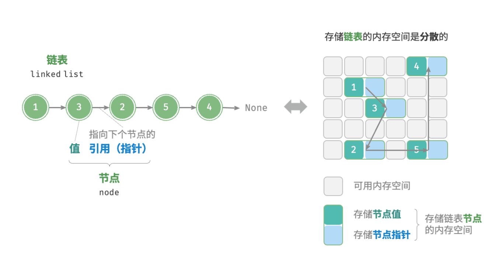
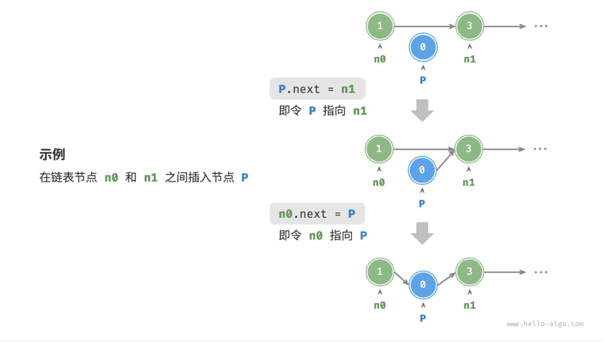
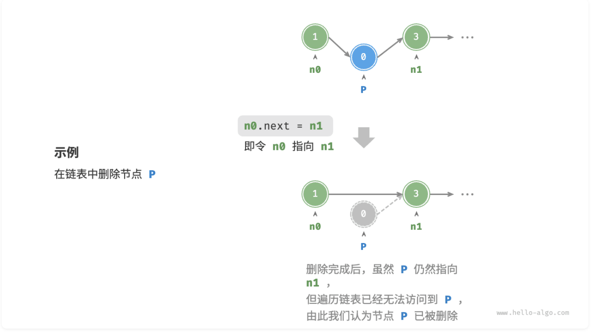

# 线性表（数组和链表）

> *<small>数据结构的世界如同一堵厚实的砖墙。</small>*
> *<small>数组的砖块整齐排列，逐个紧贴。链表的砖块分散各处，连接的藤蔓自由地穿梭于砖缝之间。</small>*

所有依赖代码位于 `List\src` 目录下。

## Baseline 任务 1：链表的基本实现

链表（linked list）是一种线性数据结构，其中的每个元素都是一个节点对象，各个节点通过“引用”相连接。引用记录了下一个节点的内存地址，通过它可以从当前节点访问到下一个节点。

链表的设计使得各个节点可以分散存储在内存各处，它们的内存地址无须连续。



链表的组成单位是节点（node）对象。每个节点都包含两项数据：节点的“值”和指向下一节点的“引用”（指针）。

一般而言，一个常见的 C++ 链表结构体定义如下：

```cpp
/* 链表节点结构体 */
struct ListNode {
    ElementType val;         // 节点值
    ListNode *next;  // 指向下一节点的指针
    ListNode(int x) : val(x), next(nullptr) {}  // 构造函数
};
```
<small>注：`ElementType` 代表节点中存储的数据类型，实际定义中一般为 `int`、`float`、`char*` 等。</small>

### 初始化链表

建立链表分为两步，第一步是初始化各个节点对象，第二步是构建节点之间的引用关系。初始化完成后，我们就可以从链表的头节点出发，通过引用（指针）指向 `next` 依次访问所有节点。

在C++中，链表的初始化可以通过`new`运算符来完成空间分配：

```cpp
/* 初始化链表 1 -> 3 -> 2 -> 5 -> 4 */
// 初始化各个节点
ListNode* n0 = new ListNode(1);
ListNode* n1 = new ListNode(3);
ListNode* n2 = new ListNode(2);
ListNode* n3 = new ListNode(5);
ListNode* n4 = new ListNode(4);
// 构建节点之间的引用
n0->next = n1;
n1->next = n2;
n2->next = n3;
n3->next = n4;
```

数组整体是一个变量，比如数组 nums 包含元素 nums[0] 和 nums[1] 等，而链表是由多个独立的节点对象组成的。我们通常将头节点当作链表的代称，比如以上代码中的链表可记作链表 n0 。

### 插入节点

在链表中插入节点非常容易。如图所示，假设我们想在相邻的两个节点 `n0` 和 `n1` 之间插入一个新节点 `P` ，则只需改变两个节点引用（指针）即可，时间复杂度为 $O(1)$ 。

相比之下，在数组中插入元素的时间复杂度为 $O(n)$ ，在大数据量下的效率较低。


C++版本的插入代码如下：

```cpp
/* 在链表的节点 n0 之后插入节点 P */
void insert(ListNode *n0, ListNode *P) {
    ListNode *n1 = n0->next;
    P->next = n1;
    n0->next = P;
}
```

### 删除节点

如图所示，在链表中删除节点也非常方便，只需改变一个节点的引用（指针）即可。

请注意，尽管在删除操作完成后节点 `P` 仍然指向 `n1` ，但实际上遍历此链表已经无法访问到 `P` ，这意味着 `P` 已经不再属于该链表了。


C++版本的删除代码如下：
```cpp
/* 删除链表的节点 n0 之后的首个节点 */
void remove(ListNode *n0) {
    if (n0->next == nullptr)
        return;
    // n0 -> P -> n1
    ListNode *P = n0->next;
    ListNode *n1 = P->next;
    n0->next = n1;
    // 释放内存
    delete P;
}
```
<small>注：内存释放是必要的，否则会造成程序内存溢出。</small>

### 访问节点

**在链表中访问节点的效率较低。** 如之前所述，我们可以在 $O(1)$ 时间下访问数组中的任意元素。链表则不然，程序需要从头节点出发，逐个向后遍历，直至找到目标节点。也就是说，访问链表的第 $i$ 个节点需要循环 $i - 1$ 轮，时间复杂度为 $O(n)$ 。

代码如下所示：

```cpp
/* 访问链表中索引为 index 的节点 */
ListNode *access(ListNode *head, int index) {
    for (int i = 0; i < index; i++) {
        if (head == nullptr)
            return nullptr;
        head = head->next;
    }
    return head;
}
```

### 查找节点

遍历链表，查找其中值为 `target` 的节点，输出该节点在链表中的索引。此过程也属于线性查找。

代码如下所示：

```cpp
/* 在链表中查找值为 target 的首个节点 */
int find(ListNode *head, int target) {
    int index = 0;
    while (head != nullptr) {
        if (head->val == target)
            return index;
        head = head->next;
        index++;
    }
    return -1;
}
```

### 任务内容

我们需要同学们完成以下内容：

- 编写链表的基本实现代码，包括节点定义、链表初始化、节点插入、节点删除、节点访问和节点查找等功能（希望同学们可以超出上述教程中给出的几种操作，编写出更多的功能函数），并写出一个测试程序来验证这些功能的正确性。（注：测试程序需要能够体现函数的特性，不能仅仅是简单的功能测试。）

- 尝试将链表实现为一个模版类（C++），支持任意数据类型的存储。编写你的测试程序来验证（要求与前一个任务相同）。

- 我们在仓库中提供了一个测试程序 `testlist.cpp`，同学们需要根据这个测试程序来完成链表的基本实现，并在完成后加入在前两个任务中实现的功能。加入新功能后的链表实现需要能够同时正确执行我们给出的测试程序和你自己编写的新测试程序。

你提交的材料中这部分内容需要包含：
- 三个小任务分别的代码（注意：代码的文件结构和注释也是评分的一部分）
- 对你程序和结果的分析（注：分析需要能够体现你对这些功能的理解，不能仅仅是简单的结果描述）

| 类别 | 提交要求 |
| --- | --- |
| 测试样例 | 在 `inputs/` 中放置 `.txt` 输入样例，在 `outputs/` 中放置同名标准输出文件；例如 `inputs/case01.txt` 对应 `outputs/case01.txt`。 |
| 测试程序 | 提交名为 `test` 的测试程序，能够自动读取 `inputs/` 中的样例，并与 `outputs/` 中的标准输出进行比对。 |
| 实现代码 | 提交本题实现所需的 `.cpp` 源文件，代码结构清晰，并保留必要注释。 |
| 构建文件 | 提交 `Makefile`，支持一条命令完成编译；建议同时提供运行样例测试的目标。 |

<details>
<summary>点击展开：Baseline 任务 1 输入输出格式与样例</summary>

注：以下测试样例仅用于说明输入输出格式，不代表完整测试覆盖范围，也不是唯一评测数据。学生需要根据该格式自行设计并生成更多测试样例，用于覆盖边界情况和自定义扩展功能。

### 输入格式
第一行输入一个整数 `n`，表示初始链表长度。
第二行输入 `n` 个整数，表示初始链表元素；当 `n = 0` 时该行为空行。
第三行输入一个整数 `m`，表示操作次数。
接下来 `m` 行，每行输入一个操作，格式如下：

| 操作 | 含义 |
| --- | --- |
| `PUSH_FRONT x` | 在链表头部插入 `x` |
| `PUSH_BACK x` | 在链表尾部插入 `x` |
| `INSERT i x` | 在下标 `i` 处插入 `x`，下标从 `0` 开始 |
| `ERASE i` | 删除下标 `i` 处的元素 |
| `ACCESS i` | 输出下标 `i` 处的元素 |
| `FIND x` | 输出值为 `x` 的第一个元素下标；不存在输出 `-1` |
| `CONTAINS x` | 输出链表是否包含 `x` |
| `SIZE` | 输出当前链表长度 |
| `PRINT` | 从头到尾输出当前链表 |
| `CLEAR` | 清空链表 |

### 输出格式
只有查询类操作产生输出：`ACCESS`、`FIND`、`CONTAINS`、`SIZE`、`PRINT`。

- `ACCESS` 越界时输出 `ERROR`。
- `INSERT`、`ERASE` 越界时不要求输出，但程序应能正确报告或处理错误；若测试程序选择输出错误信息，统一输出 `ERROR`。
- `CONTAINS` 输出 `true` 或 `false`。
- `PRINT` 输出元素时使用单个空格分隔，行末不额外要求空格；空链表输出 `EMPTY`。

### 样例数据
**输入样例：**
```text
5
1 3 5 7 9
10
PRINT
INSERT 2 4
ERASE 4
ACCESS 2
FIND 7
CONTAINS 9
PUSH_FRONT 0
PUSH_BACK 10
SIZE
PRINT
```

**输出样例：**
```text
1 3 5 7 9
4
-1
true
7
0 1 3 4 5 9 10
```
</details>


## Baseline 任务 2：可变数组的实现
数组相信大家其实已经很熟悉了（毕竟在C和C++的课程中已经拷打了很久了），但大家应该也已经发现了数组最大的问题：**数组的长度是固定的**。当我们无法确定需要存储的数据量时，数组就有可能会不够用（可能会爆）。

这时候就有人要问了，**我们能不能设计一种数据结构，既能像数组一样支持随机访问，又能像链表一样支持动态扩容呢？**

回忆 C++ 课程中 STL 库中的 `std::vector`，它就是这样一个数据结构。

可是它是怎么实现的呢？

### 任务内容
- 设计并实现一个可变数组类，要求该类支持动态扩容、随机访问等功能。你需要编写测试程序来验证你的实现。
- 评估你的可变数组实现与 C++ 标准库中的 `std::vector` 的差异，你需要在实验报告中分析他们的不同并评估优劣。
- 参考 C++ 标准库中的 `<vector>` 实现，优化你的可变数组类，添加更多的功能，如获取数组的长度、判断数组是否为空等（五个更多的功能即可），编写测试程序体现你的可变数组类的特点。
- 分析同样作为可以动态扩容的链表和可变数组在不同场景下的性能差异，你需要使用完整的测试程序来体现差异，并在报告中进行分析。

你提交的材料中这部分内容需要包含：
- 你的所有代码（注意：代码的文件结构和注释也是评分的一部分）
- 你的可变数组实现设计思路和分析
- 你的差异评估和分析

| 类别 | 提交要求 |
| --- | --- |
| 测试样例 | 在 `inputs/` 中放置 `.txt` 输入样例，在 `outputs/` 中放置同名标准输出文件；例如 `inputs/case01.txt` 对应 `outputs/case01.txt`。 |
| 测试程序 | 提交名为 `test` 的测试程序，能够自动读取 `inputs/` 中的样例，并与 `outputs/` 中的标准输出进行比对。 |
| 实现代码 | 提交本题实现所需的 `.cpp` 源文件，代码结构清晰，并保留必要注释。 |
| 构建文件 | 提交 `Makefile`，支持一条命令完成编译；建议同时提供运行样例测试的目标。 |

<details>
<summary>点击展开：Baseline 任务 2 输入输出格式与样例</summary>

注：以下测试样例仅用于说明输入输出格式，不代表完整测试覆盖范围，也不是唯一评测数据。学生需要根据该格式自行设计并生成更多测试样例，用于覆盖边界情况和自定义扩展功能。

本任务包含可变数组与 `std::vector`、链表与可变数组的性能差异比较要求，自行生成的测试样例或测试程序输出必须包含可量化的性能统计数据，例如数据规模、操作次数、运行时间（如 `time_ms`）等。

### 输入格式
第一行输入两个整数 `capacity n`，分别表示初始容量和初始元素个数。要求 `capacity >= n`。
第二行输入 `n` 个整数，表示初始数组元素；当 `n = 0` 时该行为空行。
第三行输入一个整数 `m`，表示操作次数。
接下来 `m` 行，每行输入一个操作，格式如下：

| 操作 | 含义 |
| --- | --- |
| `PUSH_BACK x` | 在数组尾部追加 `x`，容量不足时应自动扩容 |
| `INSERT i x` | 在下标 `i` 处插入 `x` |
| `ERASE i` | 删除下标 `i` 处的元素 |
| `GET i` | 输出下标 `i` 处的元素 |
| `SET i x` | 将下标 `i` 处的元素修改为 `x` |
| `SIZE` | 输出当前元素个数 |
| `CAPACITY` | 输出当前容量 |
| `EMPTY` | 输出数组是否为空 |
| `PRINT` | 从前到后输出当前数组 |
| `CLEAR` | 清空数组元素，容量是否缩减由实现自行说明 |

### 输出格式
只有查询类操作产生输出：`GET`、`SIZE`、`CAPACITY`、`EMPTY`、`PRINT`。

- `GET` 越界时输出 `ERROR`。
- `INSERT`、`ERASE`、`SET` 越界时不要求输出，但程序应能正确报告或处理错误；若测试程序选择输出错误信息，统一输出 `ERROR`。
- `EMPTY` 输出 `true` 或 `false`。
- `PRINT` 输出元素时使用单个空格分隔；空数组输出 `EMPTY`。
- 本任务包含性能差异比较要求，测试程序必须在功能输出后追加性能统计行，格式建议为 `PERF name n=<数据规模> ops=<操作次数> time_ms=<运行时间>`。

### 样例数据
**输入样例：**
```text
4 3
2 4 6
9
PRINT
PUSH_BACK 8
PUSH_BACK 10
INSERT 1 3
SET 3 7
GET 3
SIZE
CAPACITY
PRINT
```

**输出样例：**
```text
2 4 6
7
6
8
2 3 4 7 8 10
PERF vector_like n=100000 ops=200000 time_ms=18.42
PERF std_vector n=100000 ops=200000 time_ms=12.67
PERF linked_list n=100000 ops=200000 time_ms=45.31
```

注：样例中的 `CAPACITY` 输出假设扩容策略为容量翻倍，因此由 `4` 扩为 `8`。如果你采用其他扩容策略，需要在报告中说明，并保证测试程序输出与自己的实现一致。
</details>

## Baseline 任务 3：链表的进阶算法解题（经典题目）

> *<small>基本的增删查改，不过是顺流而下的平铺直叙。</small>*
> *<small>当指针开始逆流反转、于陌路中殊途同归，亦或陷入宿命般的无尽循环。</small>*

在掌握了链表的基础操作后，我们需要面对一些更具挑战性的经典算法问题。在面试和实际工程中，链表常常会出现诸如“反转结构”、“指针成环”、“多方交汇”等复杂情况。

这里列举了三个最经典的进阶场景：
1. **反转链表**：改变链表中节点指针的指向，使链表首尾倒置（空间复杂度通常可以优化至 $O(1)$）。
2. **环形链表**：链表的尾节点指向了之前的某一个节点，使得链表遍历永远无法到达 `nullptr` 终点（常使用“快慢指针”算法解决）。
3. **相交链表**：两个单独的链表在某一个节点处合并，拥有了共同的后续节点（常使用“双指针”技巧解决）。

### 综合题目：幽灵交叉路口

为了测试大家对这些算法的掌握程度，我们将这几个概念融合为一个综合编程题目。

**题目描述**：
假设你在探索两段古老的单向迷宫隧道（分别用单链表 `ListA` 和 `ListB` 表示）。这两段隧道由于地质变化，可能发生了以下异常情况：
- **诅咒循环（成环）**：迷宫可能在内部形成了死循环，进入后将无法走出。
- **殊途同归（相交）**：两条隧道可能在某处打通汇合，走到了一起并通向同一个出口（此时假设两条隧道都没有死循环）。

你需要设计一个核心算法模块，依次完成以下三个挑战：

1. **探查环路**：分别判断 `ListA` 和 `ListB` 内部是否存在环。如果存在，请找出环的“入口节点”（即发生循环的第一个节点），并**解除其环状结构**。
2. **寻找交汇点**：在确认（或已解除）两链表完全无环的前提下，判断 `ListA` 和 `ListB` 是否在某处相交。如果相交，请找出它们**开始交汇的位置**。
3. **空间逆转**：如果找到了交汇点，请将两链表交汇后的**公共部分**进行**局部反转**。注意只需要反转公共部分，原先各自独立的头部区间不能被破坏。

### 任务内容

- **算法实现**：编写上述综合题目的求解代码。要求封装为清晰的函数模块（例如 `detectAndRemoveCycle`、`getIntersectionNode`、`reverseSharedPath` 等）。
- **测试程序**：设计能够覆盖所有边界情况的测试用例。你需要手动在测试代码中构造：
  - 存在环的单条测试链表。
  - 不相交的两条独立无环链表。
  - 相交的两条无环链表。
  - 并通过简单直接的可视化输出（命令行即可），验证你各步算法结果的正确性。
- **复杂度规定**：你需要尽可能以最高效的方式完成。算法的时间复杂度总体需控制在 $O(n)$，空间复杂度要求为 $O(1)$（不得使用哈希表或额外数组来记录节点）。

你提交的材料中这部分任务需要包含：
- 综合题目的完整代码（注意：代码的文件结构、类的封装以及防泄漏的内存管理规则也是评分的一部分）。
- 你的测试用例构造方式以及程序输出截图，用于证明不同情况下的正确性。
- 进阶算法的设计思路报告，并在报告中给出你的时间与空间复杂度分析。

| 类别 | 提交要求 |
| --- | --- |
| 测试样例 | 在 `inputs/` 中放置 `.txt` 输入样例，在 `outputs/` 中放置同名标准输出文件；例如 `inputs/case01.txt` 对应 `outputs/case01.txt`。 |
| 测试程序 | 提交名为 `test` 的测试程序，能够自动读取 `inputs/` 中的样例，并与 `outputs/` 中的标准输出进行比对。 |
| 实现代码 | 提交本题实现所需的 `.cpp` 源文件，代码结构清晰，并保留必要注释。 |
| 构建文件 | 提交 `Makefile`，支持一条命令完成编译；建议同时提供运行样例测试的目标。 |

<details>
<summary>点击展开：Baseline 任务 3 输入输出格式与样例</summary>

注：以下测试样例仅用于说明输入输出格式，不代表完整测试覆盖范围，也不是唯一评测数据。学生需要根据该格式自行设计并生成更多测试样例，用于覆盖边界情况和自定义扩展功能。

### 输入格式
第一行输入一个整数 `T`，表示测试场景数量。
每个场景第一行输入一个场景类型：

| 类型 | 后续输入 |
| --- | --- |
| `CYCLE` | 输入一条链表，用于测试环检测与解除 |
| `NO_INTERSECTION` | 输入两条互不相交的无环链表 |
| `INTERSECTION` | 输入两条有公共尾部的无环链表 |

`CYCLE` 场景格式：
第一行输入两个整数 `n entry`，`n` 表示结点数量，`entry` 表示尾结点指向的环入口下标；`entry = -1` 表示无环。
第二行输入 `n` 个整数，表示链表结点值。

`NO_INTERSECTION` 场景格式：
第一行输入整数 `nA`，第二行输入 `nA` 个整数。
第三行输入整数 `nB`，第四行输入 `nB` 个整数。

`INTERSECTION` 场景格式：
第一行输入整数 `nA`，第二行输入 `nA` 个整数，表示 `ListA` 独有前缀。
第三行输入整数 `nB`，第四行输入 `nB` 个整数，表示 `ListB` 独有前缀。
第五行输入整数 `k`，第六行输入 `k` 个整数，表示两条链表共享的公共尾部。

### 输出格式
对每个场景依次输出：

- 第一行输出 `CASE t`，其中 `t` 从 `1` 开始。
- 对 `CYCLE`，输出 `CYCLE_ENTRY value` 或 `CYCLE_ENTRY NONE`，随后输出解除环后的链表。
- 对 `NO_INTERSECTION`，输出 `INTERSECTION NONE`。
- 对 `INTERSECTION`，输出 `INTERSECTION value`，随后输出公共部分反转后的 `ListA` 与 `ListB`。输出链表时元素用单个空格分隔，空链表输出 `EMPTY`。

### 样例数据
**输入样例：**
```text
3
CYCLE
5 2
1 2 3 4 5
NO_INTERSECTION
3
1 2 3
2
4 5
INTERSECTION
2
10 20
1
30
3
7 8 9
```

**输出样例：**
```text
CASE 1
CYCLE_ENTRY 3
LIST 1 2 3 4 5
CASE 2
INTERSECTION NONE
CASE 3
INTERSECTION 7
LIST_A 10 20 9 8 7
LIST_B 30 9 8 7
```
</details>
