# 栈和队列
> *<small>栈如同叠猫猫，而队列就像猫猫排队。</small>*
> *<small>两者分别代表先入后出和先入先出的逻辑关系。</small>*

所有依赖代码位于 `StackAndQueue\src` 目录下。

## Baseline 任务 1: 栈的基本实现

栈（stack）是一种遵循先入后出逻辑的线性数据结构。

我们可以将栈类比为桌面上的一摞盘子，规定每次只能移动一个盘子，那么想取出底部的盘子，则需要先将上面的盘子依次移走。我们将盘子替换为各种类型的元素（如整数、字符、对象等），就得到了栈这种数据结构。

如图所示，我们把堆叠元素的顶部称为“栈顶”，底部称为“栈底”。将把元素添加到栈顶的操作叫作“入栈”，删除栈顶元素的操作叫作“出栈”。
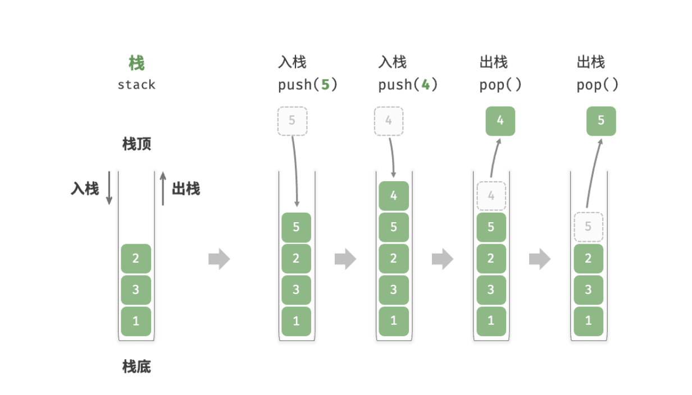

### 栈的基本操作
栈的常用操作如表所示，具体的方法名需要根据所使用的编程语言来确定。在此，我们以常见的 push()、pop()、top() 命名为例（即 C++ 中`<stack>`库中栈的对应方法）。

| 方法 | 描述 | 时间复杂度 |
| --- | --- | --- |
| `push()` | 元素入栈（添加至栈顶） | $O(1)$ |
| `pop()` | 栈顶元素出栈 | $O(1)$ |
| `top()` | 访问栈顶元素 | $O(1)$ |


没错，在 C++ 语言中，栈的数据结构已经被封装在 `<stack>` 库中，我们可以直接使用它来创建和操作栈。以下是一个简单的示例：

```cpp
/* 初始化栈 */
stack<int> stack;

/* 元素入栈 */
stack.push(1);
stack.push(3);
stack.push(2);
stack.push(5);
stack.push(4);

/* 访问栈顶元素 */
int top = stack.top();

/* 元素出栈 */
stack.pop(); // 无返回值

/* 获取栈的长度 */
int size = stack.size();

/* 判断是否为空 */
bool empty = stack.empty();
```
<small>注：上述代码需要包含头文件 `#include <stack>`</small>

当然，实际上`<stack>`库中的栈包含的函数远超过上述三种基本操作，大家可以参考 C++ 官方文档来了解更多细节：https://en.cppreference.com/w/cpp/container/stack 。

### 栈的实现
为了深入了解栈的运行机制，我们来尝试自己实现一个栈类。

栈遵循先入后出的原则，因此我们只能在栈顶添加或删除元素。然而，数组和链表都可以在任意位置添加和删除元素，**因此栈可以视为一种受限制的数组或链表**。换句话说，我们可以“屏蔽”数组或链表的部分无关操作，使其对外表现的逻辑符合栈的特性。

#### 1.基于链表的栈实现
使用链表实现栈时，我们可以将链表的头节点视为栈顶，尾节点视为栈底。

如图所示，对于入栈操作，我们只需将元素插入链表头部，这种节点插入方法被称为“头插法”。而对于出栈操作，只需将头节点从链表中删除即可。
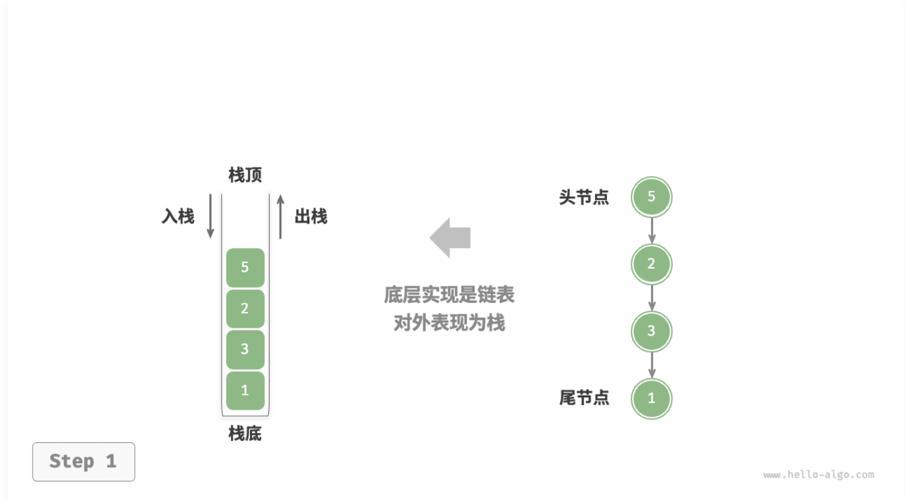

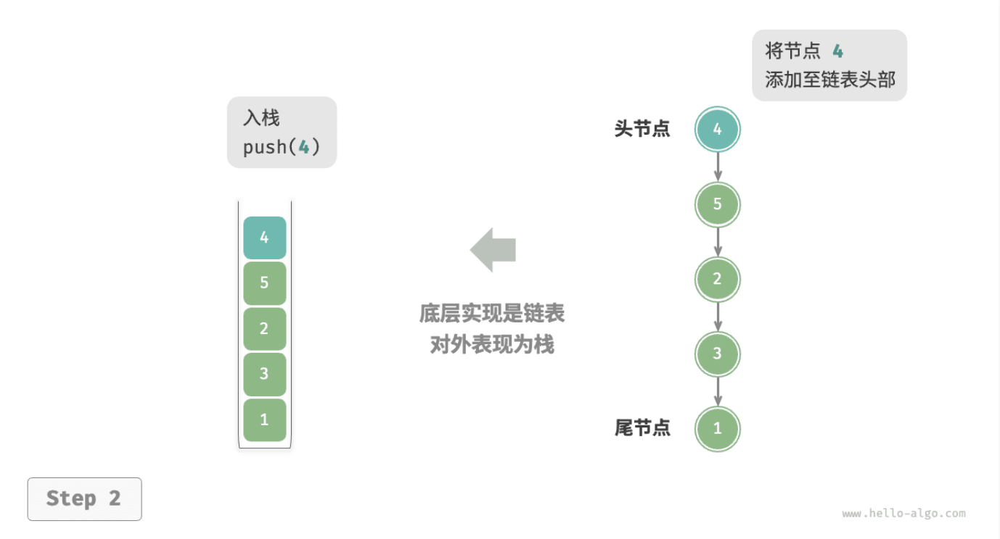

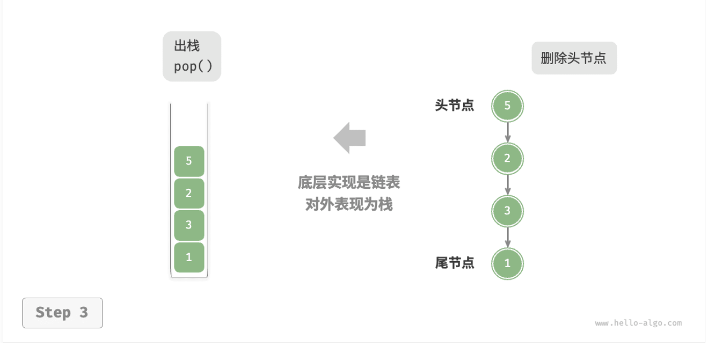

以下是基于链表实现栈的示例代码：

```cpp
/* 基于链表实现的栈 */
class LinkedListStack {
  private:
    ListNode *stackTop; // 将头节点作为栈顶
    int stkSize;        // 栈的长度

  public:
    LinkedListStack() {
        stackTop = nullptr;
        stkSize = 0;
    }

    ~LinkedListStack() {
        // 遍历链表删除节点，释放内存
        freeMemoryLinkedList(stackTop);
    }

    /* 获取栈的长度 */
    int size() {
        return stkSize;
    }

    /* 判断栈是否为空 */
    bool isEmpty() {
        return size() == 0;
    }

    /* 入栈 */
    void push(int num) {
        ListNode *node = new ListNode(num);
        node->next = stackTop;
        stackTop = node;
        stkSize++;
    }

    /* 出栈 */
    int pop() {
        int num = top();
        ListNode *tmp = stackTop;
        stackTop = stackTop->next;
        // 释放内存
        delete tmp;
        stkSize--;
        return num;
    }

    /* 访问栈顶元素 */
    int top() {
        if (isEmpty())
            throw out_of_range("栈为空");
        return stackTop->val;
    }
};
```
<small>注：上述代码中的 `ListNode` 是链表节点的定义。</small>

#### 2.基于数组的栈实现

使用数组实现栈时，我们可以将数组的尾部作为栈顶。如图所示，入栈与出栈操作分别对应在数组尾部添加元素与删除元素，时间复杂度都为 $O(1)$。
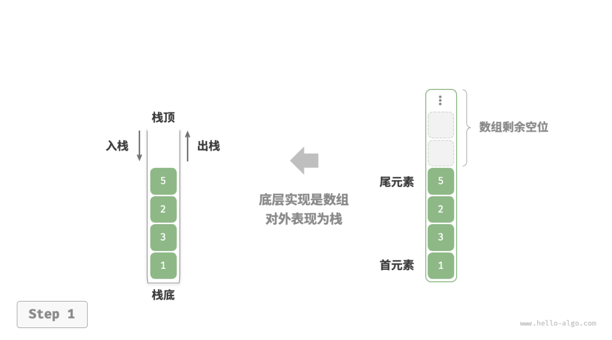

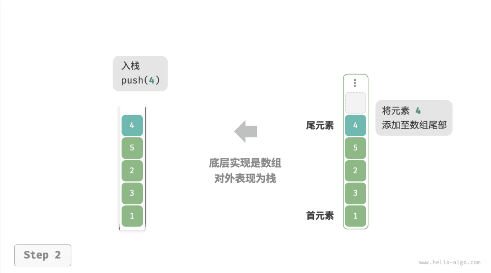

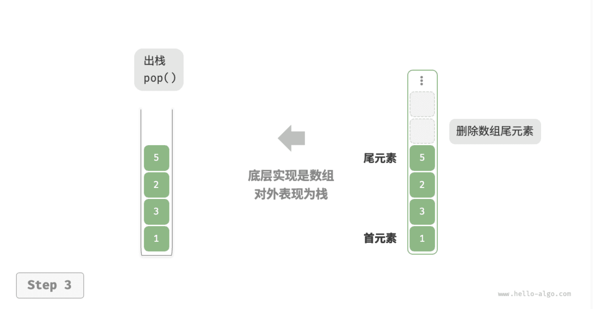

```cpp
/* 基于数组实现的栈 */
class ArrayStack {
  private:
    vector<int> stack;

  public:
    /* 获取栈的长度 */
    int size() {
        return stack.size();
    }

    /* 判断栈是否为空 */
    bool isEmpty() {
        return stack.size() == 0;
    }

    /* 入栈 */
    void push(int num) {
        stack.push_back(num);
    }

    /* 出栈 */
    int pop() {
        int num = top();
        stack.pop_back();
        return num;
    }

    /* 访问栈顶元素 */
    int top() {
        if (isEmpty())
            throw out_of_range("栈为空");
        return stack.back();
    }

    /* 返回 Vector */
    vector<int> toVector() {
        return stack;
    }
};
```
<small>注：上述代码中的 `vector` 是 C++ 标准库中的动态数组。</small>

### 任务内容

- 完成链表实现的栈类和数组实现的栈类，要求可以通过给出的测试程序（你在这一部分不可以修改测试程序）。
- 评估两种实现的性能差异，分析它们在不同场景下的优缺点，你需要使用完整的测试程序来评估性能差异，并在报告中进行分析。
- 参考 C++ 标准库中的 `<stack>` 实现，在之前实现的栈类上添加更多的功能，如获取栈的长度、判断栈是否为空等（五个更多的功能即可），并比较你的栈和 `<stack>` 库中栈的性能差异（需要查阅`<stack>`库的相关资料）。

你提交的材料中这部分内容需要包含：
- 三个小任务分别的代码（注意：代码的文件结构和注释也是评分的一部分）
- 对你程序和结果的分析（注：分析需要能够体现你对这些功能的理解，不能仅仅是简单的结果描述）
- 你对性能差异的分析（注：分析需要能够体现你对两种实现的理解，不能仅仅是简单的结果描述）

## Baseline 任务 2: 队列的基本实现
队列（queue）是一种遵循先入先出规则的线性数据结构。顾名思义，队列模拟了排队现象，即新来的人不断加入队列尾部，而位于队列头部的人逐个离开。

如图所示，我们将队列头部称为“队首”，尾部称为“队尾”，将把元素加入队尾的操作称为“入队”，删除队首元素的操作称为“出队”。

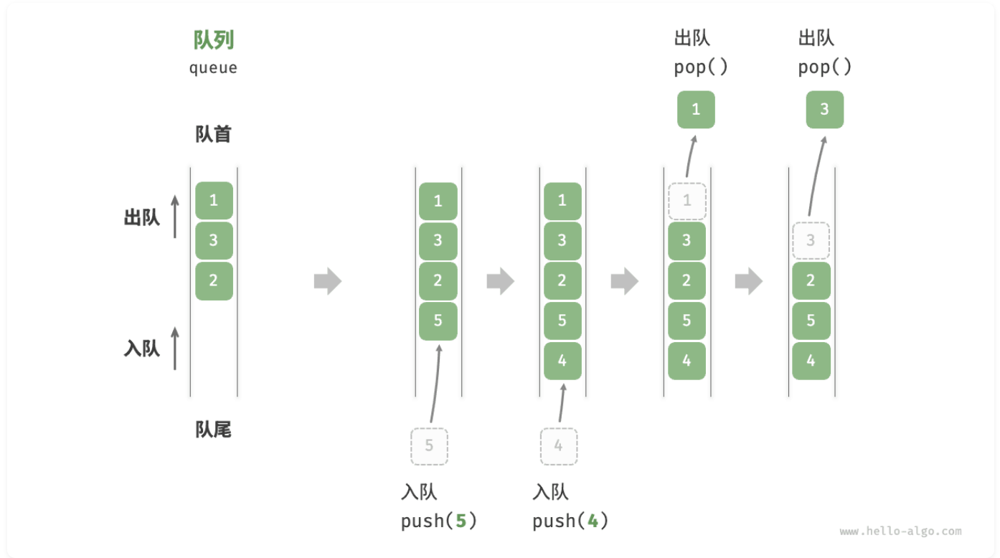

### 队列的基本操作
队列的常见操作如表所示（以 C++ 中 `<queue>` 库的对应方法为例）：

| 方法 | 描述 | 时间复杂度 |
| --- | --- | --- |
| `push()` | 元素入队（添加至队尾） | $O(1)$ |
| `pop()` | 队首元素出队 | $O(1)$ |
| `front()` | 访问队首元素 | $O(1)$ |

我们可以直接使用 C++ 中现成的队列类：
```cpp
/* 初始化队列 */
queue<int> queue;

/* 元素入队 */
queue.push(1);
queue.push(3);
queue.push(2);
queue.push(5);
queue.push(4);

/* 访问队首元素 */
int front = queue.front();

/* 元素出队 */
queue.pop();

/* 获取队列的长度 */
int size = queue.size();

/* 判断队列是否为空 */
bool empty = queue.empty();
```
<small>注：上述代码需要包含头文件 `#include <queue>`</small>

### 队列的实现
为了实现队列，我们需要一种数据结构，可以在一端添加元素，并在另一端删除元素，链表和数组都符合要求。
#### 1.基于链表的实现
如下图所示，我们可以将链表的“头节点”和“尾节点”分别视为“队首”和“队尾”，规定队尾仅可添加节点，队首仅可删除节点。

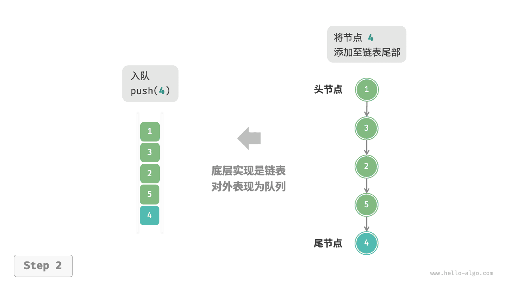
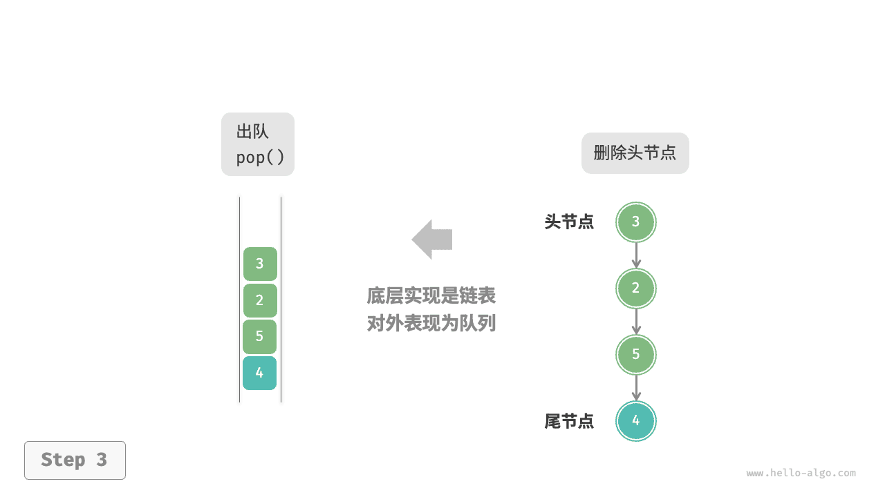

```cpp
/* 基于链表实现的队列 */
class LinkedListQueue {
  private:
    ListNode *front, *rear; // 头节点 front ，尾节点 rear
    int queSize;

  public:
    LinkedListQueue() {
        front = nullptr;
        rear = nullptr;
        queSize = 0;
    }

    ~LinkedListQueue() {
        // 遍历链表删除节点，释放内存
        freeMemoryLinkedList(front);
    }

    /* 获取队列的长度 */
    int size() {
        return queSize;
    }

    /* 判断队列是否为空 */
    bool isEmpty() {
        return queSize == 0;
    }

    /* 入队 */
    void push(int num) {
        // 在尾节点后添加 num
        ListNode *node = new ListNode(num);
        // 如果队列为空，则令头、尾节点都指向该节点
        if (front == nullptr) {
            front = node;
            rear = node;
        }
        // 如果队列不为空，则将该节点添加到尾节点后
        else {
            rear->next = node;
            rear = node;
        }
        queSize++;
    }

    /* 出队 */
    int pop() {
        int num = peek();
        // 删除头节点
        ListNode *tmp = front;
        front = front->next;
        // 释放内存
        delete tmp;
        queSize--;
        return num;
    }

    /* 访问队首元素 */
    int peek() {
        if (size() == 0)
            throw out_of_range("队列为空");
        return front->val;
    }

    /* 将链表转化为 Vector 并返回 */
    vector<int> toVector() {
        ListNode *node = front;
        vector<int> res(size());
        for (int i = 0; i < res.size(); i++) {
            res[i] = node->val;
            node = node->next;
        }
        return res;
    }
};
```
<small>注：上述代码中的 `ListNode` 是链表节点的定义。</small>

#### 2.基于数组的实现

在数组中删除首元素的时间复杂度为 $O(n)$ ，这会导致出队操作效率较低。然而，我们可以采用以下巧妙方法来避免这个问题。

我们可以使用一个变量 `front` 指向队首元素的索引，并维护一个变量 `size` 用于记录队列长度。定义 `rear = front + size` ，这个公式计算出的 `rear` 指向队尾元素之后的下一个位置。

基于此设计，**数组中包含元素的有效区间为 `[front, rear - 1]`**，各种操作的实现方法如下图所示。

- 入队操作：将输入元素赋值给 `rear` 索引处，并将 `size` 增加 1 。
- 出队操作：只需将 `front` 增加 1 ，并将 `size` 减少 1 。

可以看到，入队和出队操作都只需进行一次操作，时间复杂度均为 $O(1)$ 。

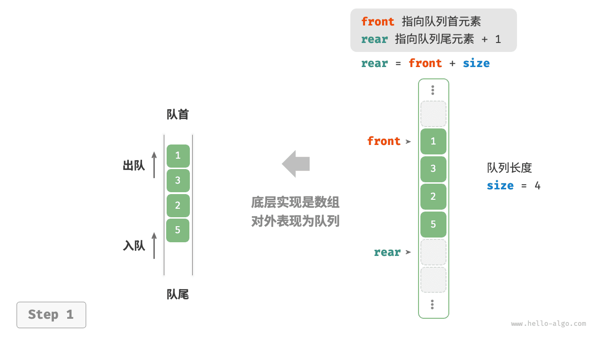


你可能会发现一个问题：在不断进行入队和出队的过程中，`front` 和 `rear` 都在向右移动，**当它们到达数组尾部时就无法继续移动了**。

### 任务内容
- 完成链表实现的队列类和数组实现的队列类，要求可以通过给出的测试程序（你在这一部分不可以修改测试程序）。
- 我们在**基于数组的实现**中提到，当 `front` 和 `rear` 到达数组尾部时就无法继续移动了。请你设计至少两种方法来解决这个问题，在代码中实现它并测试。
- 评估两种实现的性能差异，分析它们在不同场景下的优缺点，你需要使用完整的测试程序来评估性能差异，并在报告中进行分析。
- 参考 C++ 标准库中的 `<queue>` 实现，在之前实现的队列类上添加更多的功能，如获取队列的长度、判断队列是否为空等（五个更多的功能即可），并比较你的队列和 `<queue>` 库中队列的性能差异（需要查阅`<queue>`库的相关资料）。

你提交的材料中这部分内容需要包含：
- 四个小任务分别的代码（注意：代码的文件结构和注释也是评分的一部分）
- 对于**基于数组的实现**中设计的至少两种解决 `front` 和 `rear` 到达数组尾部问题解决方案思路的详细说明。
- 对你程序和结果的分析（注：分析需要能够体现你对这些功能的理解，不能仅仅是简单的结果描述）
- 你对性能差异的分析（注：分析需要能够体现你对两种实现的理解，不能仅仅是简单的结果描述）

## Baseline 任务 3: 栈和队列的综合应用

事实上，我们发现栈和队列其实很像，一个是先入后出（LIFO），一个是先入先出（FIFO）。本质上，二者只是对数据的存取顺序进行了限制，而底层的数据结构可以是相同的。

接下来，我们希望你可以思考，有没有什么方式可以使这二者之间相互转换呢？也就是说，我们是否可以使用队列来实现一个栈，或者使用栈来实现一个队列呢？

### 任务内容
- 设计并实现一个类，使用队列来实现一个栈，要求该类支持栈的基本操作（入栈、出栈、访问栈顶元素等）。你需要编写测试程序来验证你的实现。
- 设计并实现一个类，使用栈来实现一个队列，要求该类支持队列的基本操作（入队、出队、访问队首元素等）。你需要编写测试程序来验证你的实现。
- 使用`<vector>`库中来实现上述两个类，其中各自需要一个函数可以使其可以相互转换（即栈类中需要一个函数可以将其转换为队列类，队列类中需要一个函数可以将其转换为栈类）。你需要编写测试程序来验证这些函数的正确性。
- 评估对比栈实现队列和`<vector>`实现队列的差异，你需要使用完整的测试程序来体现差异，并在报告中进行分析。
- 评估对比队列实现栈和`<vector>`实现栈的差异，你需要使用完整的测试程序来体现差异，并在报告中进行分析。

你提交的材料中这部分内容需要包含：
- 你的所有代码（注意：代码的文件结构和注释也是评分的一部分）
- 对你前两个小任务实现原理的解释
- 对你程序和测试结果的分析