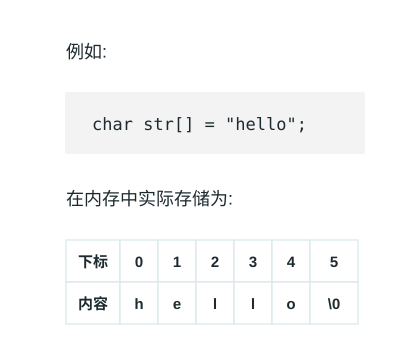

# 字符串 (String)

> 字符串就如同由字符穿成的一串珍珠。
>
> 在文海中寻找特征，就如同在这串珍珠中寻找特定的花纹。

所有依赖代码位于 `String\src` 目录下。


## Baseline 任务 1: 字符串的基本实现

字符串（String）是由零个或多个字符组成的有限序列。

我们可以将字符串类比为一段连续存放的文字，虽然在很多高级语言中它已经被封装成基本的数据类型或者对象，但从存储结构上看，字符串本质上是一个元素类型为字符的线性表。最常见的存储形式就是顺序存储（即字符数组）。

如图所示，由于字符串中的字符在内存中是连续存取的，我们可以使用下标来快速访问对应的字符。



### 字符串的基本操作

字符串的常用操作如表所示，具体的方法名需要根据所使用的编程语言来确定。在此，我们以常见的求长度、拼接、求子串等命名为例（即 C++ 中`<string>`库中对应方法）。

| 方法 | 描述 | 时间复杂度 |
| --- | --- | --- |
| `length()` | 获取字符串长度 | $O(1)$ |
| `append()` | 在字符串末尾拼接另一个字符串 | $O(m)$ |
| `substr()` | 从指定位置截取指定长度的子串 | $O(k)$ |

在 C++ 语言中，字符串的数据结构已经被封装在 `<string>` 库中，我们可以直接使用它来创建和操作字符串。以下是一个简单的示例：

```text
/* 初始化字符串 */
string str1 = "Hello";
string str2 = " World";

/* 字符串拼接 */
string str3 = str1 + str2; // "Hello World"
str1.append("!");          // "Hello!"

/* 访问特定字符 */
char c = str3[0]; // 'H'

/* 截取子串 */
string sub = str3.substr(0, 5); // "Hello"

/* 获取长度 */
int len = str3.length();

/* 字符串比较 */
bool isEqual = (str1 == str3);
```

注：上述代码需要包含头文件 `#include <string>`

实际上`<string>`库中的字符串包含的功能远超过上述基本操作，大家可以参考 C++ 官方文档来了解更多细节：https://en.cppreference.com/w/cpp/string/basic_string 。

### 字符串的实现

为了深入了解字符串的运行机制，我们可以尝试自己实现一个顺序存储的字符串类。

#### 基于动态数组的字符串实现

最直接的实现方式就是通过动态维护一个字符数组及其长度（以及容量以避免频繁扩容）。

```text
/* 基于动态数组实现的字符串 */
class MyString {
  private:
    char* data; // 字符数组指针
    int len;    // 字符串长度

  public:
    MyString() {
        data = new char[1];
        data[0] = '\0';
        len = 0;
    }

    MyString(const char* str) {
        len = 0;
        while (str[len] != '\0') len++;
        data = new char[len + 1];
        for (int i = 0; i < len; i++) {
            data[i] = str[i];
        }
        data[len] = '\0';
    }

    ~MyString() {
        delete[] data;
    }

    /* 获取字符串长度 */
    int length() {
        return len;
    }

    /* 截取子串 */
    MyString substr(int pos, int n) {
        if (pos < 0 || pos >= len)
            throw out_of_range("越界");
        int subLen = (pos + n > len) ? (len - pos) : n;
        char* temp = new char[subLen + 1];
        for (int i = 0; i < subLen; i++) {
            temp[i] = data[pos + i];
        }
        temp[subLen] = '\0';
        MyString result(temp);
        delete[] temp;
        return result;
    }
};
```

### 任务内容

- 完成顺序存储的字符串类的实现，要求可以通过给出的测试程序（你在这一部分不可以修改测试程序，需自己基于上述框架补充拼接、查找等基本方法）。
- 参考 C++ 标准库中的 `<string>` 实现，在你的字符串类上添加更多的功能，如查找特定子串、替换子串等（五个更多的功能即可），并比较你的字符串在频繁拼接时与 `<string>` 库的性能差异。
- 分析动态扩容策略对字符串连接（如连续拼接百万次）性能的影响。

你提交的材料中这部分内容需要包含：

- 三个小任务分别的代码（注意：代码的文件结构和注释也是评分的一部分）
- 对你程序和结果的分析（注：分析需要能够体现你对这些功能的理解，不能仅仅是简单的结果描述）
- 你对性能差异的分析（注：分析需要能够体现你对数组扩容等机制的理解，不能仅仅是简单的结果描述）

| 类别 | 提交要求 |
| --- | --- |
| 测试样例 | 在 `inputs/` 中放置 `.txt` 输入样例，在 `outputs/` 中放置同名标准输出文件；例如 `inputs/case01.txt` 对应 `outputs/case01.txt`。 |
| 测试程序 | 提交名为 `test` 的测试程序，能够自动读取 `inputs/` 中的样例，并与 `outputs/` 中的标准输出进行比对。 |
| 实现代码 | 提交本题实现所需的 `.cpp` 源文件，代码结构清晰，并保留必要注释。 |
| 构建文件 | 提交 `Makefile`，支持一条命令完成编译；建议同时提供运行样例测试的目标。 |

<details>
<summary>点击展开：Baseline 任务 1 输入输出格式与样例</summary>

**注：**以下测试样例仅用于说明输入输出格式，不代表完整测试覆盖范围，也不是唯一评测数据。学生需要根据该格式自行设计并生成更多测试样例，用于覆盖边界情况和自定义扩展功能。本任务包含字符串类与 `std::string`、不同扩容策略的性能差异比较要求，自行生成的测试样例或测试程序输出必须包含可量化的性能统计数据，例如数据规模、操作次数、运行时间（如 `time_ms`）等。

#### 输入格式

| 行号 | 内容 | 说明 |
| --- | --- | --- |
| 第 1 行 | `s` | 初始字符串；默认不包含空白字符，空字符串输入 `EMPTY` |
| 第 2 行 | `m` | 操作次数 |
| 接下来 `m` 行 | `op args...` | 每行一个操作 |

| 操作 | 含义 |
| --- | --- |
| `PRINT` | 输出当前字符串 |
| `LENGTH` | 输出当前字符串长度 |
| `APPEND t` | 将字符串 `t` 拼接到当前字符串末尾 |
| `SUBSTR pos len` | 输出从下标 `pos` 开始、长度为 `len` 的子串 |
| `FIND t` | 输出子串 `t` 首次出现的下标；不存在输出 `-1` |
| `REPLACE old new` | 将首次出现的子串 `old` 替换为 `new` |
| `COMPARE t` | 相等输出 `0`，小于输出 `-1`，大于输出 `1` |
| `CLEAR` | 清空当前字符串 |

#### 输出格式

| 项目 | 规定 |
| --- | --- |
| 产生输出的操作 | `PRINT`、`LENGTH`、`SUBSTR`、`FIND`、`COMPARE` |
| 越界访问 | `SUBSTR` 越界输出 `ERROR` |
| 空字符串 | 输出 `EMPTY` |
| 性能统计 | 本任务包含性能差异比较要求，必须在功能输出后追加 `PERF name n=<数据规模> ops=<操作次数> time_ms=<运行时间>` |

**输入样例：**

```text
Hello
9
PRINT
LENGTH
APPEND World
SUBSTR 5 5
FIND World
REPLACE World String
COMPARE HelloString
PRINT
LENGTH
```

**输出样例：**

```text
Hello
5
World
5
0
HelloString
11
PERF my_string n=100000 ops=200000 time_ms=24.18
PERF std_string n=100000 ops=200000 time_ms=13.76
PERF my_string_reserve n=100000 ops=200000 time_ms=9.42
```

</details>

## Baseline 任务 2: 字符串的模式匹配

字符串在日常中的最核心操作就是**模式匹配（Pattern Matching）**：即在主串中寻找是否出现了给定的子串（模式串），并返回其位置。

### 1. 朴素模式匹配算法

朴素算法使用双指针，逐个字符向后比对。如果发现不匹配，主串退回到上一次比对起点的下一个字符，模式串退回到开头。 如图所示，每次发现失配，都“笨拙”地仅仅向右移动一位重新开始。

```text
/* 朴素模式匹配算法 */
int naiveMatch(const string& text, const string& pattern) {
    int n = text.length(), m = pattern.length();
    for (int i = 0; i <= n - m; i++) {
        int j = 0;
        while (j < m && text[i + j] == pattern[j]) {
            j++;
        }
        if (j == m) return i; // 匹配成功，返回起点
    }
    return -1; // 匹配失败
}
```

### 2. KMP 算法

KMP 算法（Knuth-Morris-Pratt Algorithm）消除了主串指针的回溯。它通过对模式串的分析，得到了一个 `next` 数组（或称为失败函数），指示在发生失配时，模式串可以向右滑动的最大安全距离，从而保证主串指针只需一直向前移动。

这个视频可以帮助同学们直观理解：https://www.bilibili.com/video/BV1AY4y157yL

KMP 算法的实现核心在于 `next` 数组的求解：

```text
/* 求解 next 数组的简易实现 */
vector<int> getNext(const string& pattern) {
    int m = pattern.length();
    vector<int> next(m, 0);
    int head = 0;
    for (int tail = 1; tail < m; tail++) {
        while (head > 0 && pattern[head] != pattern[tail]) {
            head = next[head - 1];
        }
        if (pattern[head] == pattern[tail]) {
            head++;
        }
        next[tail] = head;
    }
    return next;
}
```

### 任务内容

为了更好地理解模式匹配，本练习分为了三个递进的步骤，建议按顺序完成：

- **Step 1. 分析与测试朴素算法**：构造极端的测试用例文本（例如主串是由大量重复字符凑成，末尾才失配），在自行编写的测试程序中测试并记录朴素算法在最坏情况下的耗时和表现。
- **Step 2. 基础 KMP 算法的实现**：在 ` match.cpp` 中实现完整的 KMP 模式匹配算法（可直接调用前置写好的 `getNext` 函数）。然后使用在 Step 1 中构造的极端用例，对比它与朴素算法在性能上的巨大差异。
- **Step 3. nextval 数组深度优化**：针对原始 `next` 数组在连续相同字符时依然会多余比较的缺陷，实现优化的 `nextval` 求解算法。自己设计测试样例结合 `nextval` 运行终极版的 KMP 匹配，观察其具体区别和常数级性能提升。

你提交的材料中这部分内容需要包含：

- 三个小任务分别的代码（注意：代码的文件结构和注释也是评分的一部分）
- 对你程序和结果的分析（注：分析需要能够体现你对这些模式匹配算法过程的理解，不能仅仅是简单的结果描述）
- 你对性能差异的分析（注：分析需要能够体现你对时间和空间复杂度的理解，不能仅仅是简单的结果描述）

| 类别 | 提交要求 |
| --- | --- |
| 测试样例 | 在 `inputs/` 中放置 `.txt` 输入样例，在 `outputs/` 中放置同名标准输出文件；例如 `inputs/case01.txt` 对应 `outputs/case01.txt`。 |
| 测试程序 | 提交名为 `test` 的测试程序，能够自动读取 `inputs/` 中的样例，并与 `outputs/` 中的标准输出进行比对。 |
| 实现代码 | 提交本题实现所需的 `.cpp` 源文件，代码结构清晰，并保留必要注释。 |
| 构建文件 | 提交 `Makefile`，支持一条命令完成编译；建议同时提供运行样例测试的目标。 |

<details>
<summary>点击展开：Baseline 任务 2 输入输出格式与样例</summary>

**注：**以下测试样例仅用于说明输入输出格式，不代表完整测试覆盖范围，也不是唯一评测数据。学生需要根据该格式自行设计并生成更多测试样例，用于覆盖边界情况和自定义扩展功能。本任务包含朴素匹配、KMP 与 nextval 优化的性能差异比较要求，自行生成的测试样例或测试程序输出必须包含可量化的性能统计数据，例如数据规模、操作次数、运行时间（如 `time_ms`）等。

#### 输入格式

| 行号 | 内容 | 说明 |
| --- | --- | --- |
| 第 1 行 | `text` | 主串 |
| 第 2 行 | `pattern` | 模式串 |
| 第 3 行 | `m` | 操作次数 |
| 接下来 `m` 行 | `op` | 每行一个操作 |

| 操作 | 含义 |
| --- | --- |
| `NEXT` | 输出模式串的 `next` 数组 |
| `NEXTVAL` | 输出模式串的 `nextval` 数组 |
| `NAIVE` | 使用朴素算法匹配并输出首次匹配下标；不存在输出 `-1` |
| `KMP` | 使用 KMP 算法匹配并输出首次匹配下标；不存在输出 `-1` |
| `KMP_NEXTVAL` | 使用 nextval 优化后的 KMP 匹配并输出首次匹配下标；不存在输出 `-1` |
| `ALL` | 依次输出 `NAIVE`、`KMP`、`KMP_NEXTVAL` 的匹配下标 |

#### 输出格式

| 项目 | 规定 |
| --- | --- |
| 普通输出 | 每个操作按输入顺序产生一行输出 |
| 数组输出 | 使用单个空格分隔 |
| 匹配下标 | 从 `0` 开始，不存在输出 `-1` |
| 性能统计 | 本任务包含性能差异比较要求，必须在功能输出后追加 `PERF name n=<主串长度> m=<模式串长度> time_ms=<运行时间>` |

**输入样例：**

```text
AAAAAAAAAAB
AAAAB
5
NEXT
NEXTVAL
NAIVE
KMP
KMP_NEXTVAL
```

**输出样例：**

```text
0 1 2 3 0
0 0 0 0 0
6
6
6
PERF naive n=11 m=5 time_ms=0.018
PERF kmp n=11 m=5 time_ms=0.006
PERF kmp_nextval n=11 m=5 time_ms=0.005
```

</details>

## Baseline 任务 3: 双链 DNA 目标蛋白编码片段检索

### 项目简介

接下来我们希望大家利用字符串相关知识，来实现一个经典的生物信息学算法计算模块——**DNA 目标蛋白编码片段检索**。

在 DNA 中，遗传信息由四种碱基（A, T, C, G）组成。每连续三个碱基构成一个**密码子**并翻译为一个氨基酸或者终止符号，例如 `ATG -> M`、`GCT -> A`、`TAA -> *`。一条 DNA 序列不仅可以从第 1、2、3 个碱基开始读取，即存在**三种阅读框**，而且由于具有双链结构，它还包含一条**反向互补序列**，需要将序列反转并将 `A<->T`、`C<->G` 互换。

例如，当前序列为：

```text
S = AATGGCTTTAAGCCATCATGGCC
P = MA
```

其正向链的第一种阅读框中包含 `ATGGCT` 和 `ATGGCC`，都能翻译为 `MA`。同时在其反向互补链中也能翻译出 `MA` 的片段。我们需要将这些匹配转换回原始 DNA 序列的区间坐标，并回答给定的区间范围内完整包含多少个能够编码目标蛋白质的 DNA 片段。

本项目为了突出字符串数据结构的使用，大家将被提供一段 DNA 序列 `S`、目标蛋白质序列 `P` 以及查询次数 `q`。程序需要对正/反向双链的 6 种阅读框进行翻译，通过**高效的字符串匹配算法（如 KMP）**在这 6 条蛋白质序列中查找目标蛋白质，最后对于给定的多个区间查询 `[l, r]` 实现快速统计作答。

### 项目要求

1. **核心算法设计**：鼓励并要求自主设计或实现高效的字符串匹配算法完成蛋白质序列匹配，**不能**直接调用语言自带的字符串查找函数。为了证明你使用了线性时间复杂度的高效算法（如 KMP 算法等），第一行要求额外计算并输出目标蛋白质序列 `P` 的匹配状态特征数组（例如 KMP 的前缀函数 `pi` 数组）。如果使用普通暴力算法又省略输出该特征数组，不仅将导致在此项被扣分，还极有可能在进阶的大型数据测试中超时。
2. **生信逻辑实现**：必须考虑正向链和反向互补链（2 种），以及每条链的三种阅读框（共 6 种情况）。将找到的匹配位置（支持重叠）准确转换回原 DNA 序列的区间 `L` 和 `R`，并输出链方向（`+` 或 `-`）和阅读框编号（`1, 2, 3`）。
3. **高效查询处理**：对于多次区间查询 `[l, r]`，由于查询次数可能非常大（`q <= 2 * 10^5`），你不能每次重新扫描序列。必须设计预处理（如前缀和等）来快速统计所给区间内完整包含特定序列的块数。
4. **代码质量**：编写清晰、可维护的代码，并添加适当的注释和文档。时间复杂度要求尽量达到 `O(n + m + q)`。

<details>
<summary>点击展开：Baseline 任务 3 输入输出格式与样例</summary>

**注：**以下测试样例仅用于说明输入输出格式，不代表完整测试覆盖范围，也不是唯一评测数据。学生需要根据该格式自行设计并生成更多测试样例，用于覆盖边界情况和自定义扩展功能。

#### 密码子翻译规则与匹配区间限制

本题使用标准遗传密码表，例如 `ATG -> M`、`GCC/GCT/GCA/GCG -> A`、`TAA/TAG/TGA -> *` 等。`*` 表示终止密码子。如果翻译序列中出现 `*`，它可以看作一个普通字符参与 KMP 扫描，但目标序列 `P` 不含 `*`。设 `P` 的长为 `m`，匹配长度均为 `3m`。区间坐标查询 `[l, r]` 只计算被**完全包含**的片段个数，即右端点不超过 `r`，左端点不小于 `l` 的连续序列。

#### 输入格式

| 行号 | 内容 | 说明 |
| --- | --- | --- |
| 第 1 行 | `S` | DNA 序列 |
| 第 2 行 | `P` | 目标蛋白质序列 |
| 第 3 行 | `q` | 查询次数 |
| 接下来 `q` 行 | `l r` | 查询区间 `[l, r]` |

#### 输出格式

| 位置 | 内容 | 说明 |
| --- | --- | --- |
| 第 1 行 | `pi` 数组 | 目标蛋白质序列 `P` 的匹配状态特征数组；普通暴力匹配需输出 `-1` 标明未实现特征数组 |
| 第 2 行 | `K` | 找到的总匹配数 |
| 接下来 `K` 行 | `L R strand frame` | 匹配片段区间、链方向和阅读框；按 `L` 从小到大排序，`L` 相同时按 `strand` 和 `frame` 排序 |
| 最后 `q` 行 | `answer` | 每个查询区间内完整包含的匹配数量 |

#### 样例数据

**输入样例：**

```text
AATGGCTTTAAGCCATCATGGCC
MA
6
1 7
1 16
10 16
12 23
1 23
3 17
```

**输出样例：**

```text
0 0
3
2 7 + 2
11 16 - 2
18 23 + 3
1
2
1
1
3
1
```

</details>

### 报告内容

你的实验报告需要至少包含以下要点：

- 你的设计思路（采用的匹配算法原理及其特征状态捕捉、反向互补坐标如何映射、如何处理多次区间查询等）。
- 各个核心功能函数的代码原理解释。
- 运行说明与时间复杂度分析。

### 提交要求

你提交的材料中这部分内容需要包含：

| 类别 | 提交要求 |
| --- | --- |
| 测试样例 | 在 `inputs/` 中放置 `.txt` 输入样例，在 `outputs/` 中放置同名标准输出文件；例如 `inputs/case01.txt` 对应 `outputs/case01.txt`。 |
| 测试程序 | 提交名为 `test` 的测试程序，能够自动读取 `inputs/` 中的样例，并与 `outputs/` 中的标准输出进行比对。 |
| 实现代码 | 提交本题实现所需的 `.cpp` 源文件，代码结构清晰，并保留必要注释。 |
| 构建文件 | 提交 `Makefile`，支持一条命令完成编译；建议同时提供运行样例测试的目标。 |

### 评分标准

- **基础匹配实现（30%）**：自主实现了高效的字符串匹配算法（最推荐 KMP），并且完整梳理出 6 条可能阅读框的蛋白质翻译工作；能够按要求输出特征状态数组。如果是粗暴匹配（`O(nm)` 时间复杂度）或无法给出特征状态，该项只能获得部分分数并可能导致大型测试集不通过。你需要在实验报告中提供匹配算法的设计思路。
- **坐标映射与查询优化（30%）**：合理转化反向互补链及阅读框坐标，正确运用前缀和等时间优化技巧，使得多区间查询的时间复杂度符合预期。你需要在报告中阐明数据结构的优化原理。
- **鲁棒性（20%）**：代码能够正确应对包含交叉重叠匹配、区间无法容纳目标串等边缘用例，以及未越界的准确判断。
- **代码质量（20%）**：编写清晰、可维护的代码，并添加适当的注释和文档。

注：以上评分标准同时基于你的报告和实际程序内容进行评估。
