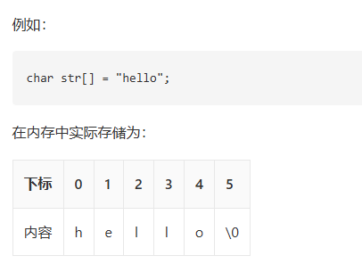

# 字符串 (String)
> *<small>字符串就如同由字符穿成的一串珍珠。</small>*
> *<small>在文海中寻找特征，就如同在这串珍珠中寻找特定的花纹。</small>*

所有依赖代码位于 `String\src` 目录下。

## Baseline 任务 1: 字符串的基本实现

字符串（String）是由零个或多个字符组成的有限序列。

我们可以将字符串类比为一段连续存放的文字，虽然在很多高级语言中它已经被封装成基本的数据类型或者对象，但从存储结构上看，字符串本质上是一个元素类型为字符的线性表。最常见的存储形式就是顺序存储（即字符数组）。

如图所示，由于字符串中的字符在内存中是连续存取的，我们可以使用下标来快速访问对应的字符。



### 字符串的基本操作
字符串的常用操作如表所示，具体的方法名需要根据所使用的编程语言来确定。在此，我们以常见的求长度、拼接、求子串等命名为例（即 C++ 中`<string>`库中对应方法）。

| 方法 | 描述 | 时间复杂度 |
| --- | --- | --- |
| `length()` | 获取字符串长度 | $O(1)$ |
| `append()` | 在字符串末尾拼接另一个字符串 | $O(m)$ |
| `substr()` | 从指定位置截取指定长度的子串 | $O(k)$ |


在 C++ 语言中，字符串的数据结构已经被封装在 `<string>` 库中，我们可以直接使用它来创建和操作字符串。以下是一个简单的示例：

```cpp
/* 初始化字符串 */
string str1 = "Hello";
string str2 = " World";

/* 字符串拼接 */
string str3 = str1 + str2; // "Hello World"
str1.append("!");          // "Hello!"

/* 访问特定字符 */
char c = str3[0]; // 'H'

/* 截取子串 */
string sub = str3.substr(0, 5); // "Hello"

/* 获取长度 */
int len = str3.length();

/* 字符串比较 */
bool isEqual = (str1 == str3);
```
<small>注：上述代码需要包含头文件 `#include <string>`</small>

实际上`<string>`库中的字符串包含的功能远超过上述基本操作，大家可以参考 C++ 官方文档来了解更多细节：https://en.cppreference.com/w/cpp/string/basic_string 。

### 字符串的实现
为了深入了解字符串的运行机制，我们可以尝试自己实现一个顺序存储的字符串类。

#### 基于动态数组的字符串实现

最直接的实现方式就是通过动态维护一个字符数组及其长度（以及容量以避免频繁扩容）。

```cpp
/* 基于动态数组实现的字符串 */
class MyString {
  private:
    char* data; // 字符数组指针
    int len;    // 字符串长度

  public:
    MyString() {
        data = new char[1];
        data[0] = '\0';
        len = 0;
    }

    MyString(const char* str) {
        len = 0;
        while (str[len] != '\0') len++;
        data = new char[len + 1];
        for (int i = 0; i < len; i++) {
            data[i] = str[i];
        }
        data[len] = '\0';
    }

    ~MyString() {
        delete[] data;
    }

    /* 获取字符串长度 */
    int length() {
        return len;
    }

    /* 截取子串 */
    MyString substr(int pos, int n) {
        if (pos < 0 || pos >= len)
            throw out_of_range("越界");
        int subLen = (pos + n > len) ? (len - pos) : n;
        char* temp = new char[subLen + 1];
        for (int i = 0; i < subLen; i++) {
            temp[i] = data[pos + i];
        }
        temp[subLen] = '\0';
        MyString result(temp);
        delete[] temp;
        return result;
    }
};
```

### 任务内容

- 完成顺序存储的字符串类的实现，要求可以通过给出的测试程序（你在这一部分不可以修改测试程序，需自己基于上述框架补充拼接、查找等基本方法）。
- 参考 C++ 标准库中的 `<string>` 实现，在你的字符串类上添加更多的功能，如查找特定子串、替换子串等（五个更多的功能即可），并比较你的字符串在频繁拼接时与 `<string>` 库的性能差异。
- 分析动态扩容策略对字符串连接（如连续拼接百万次）性能的影响。

你提交的材料中这部分内容需要包含：
- 三个小任务分别的代码（注意：代码的文件结构和注释也是评分的一部分）
- 对你程序和结果的分析（注：分析需要能够体现你对这些功能的理解，不能仅仅是简单的结果描述）
- 你对性能差异的分析（注：分析需要能够体现你对数组扩容等机制的理解，不能仅仅是简单的结果描述）

<details>
<summary>点击展开：Baseline 任务 1 输入输出格式与样例</summary>

注：以下测试样例仅用于说明输入输出格式，不代表完整测试覆盖范围，也不是唯一评测数据。学生需要根据该格式自行设计并生成更多测试样例，用于覆盖边界情况和自定义扩展功能。本任务包含字符串类与 `std::string`、不同扩容策略的性能差异比较要求，自行生成的测试样例或测试程序输出必须包含可量化的性能统计数据，例如数据规模、操作次数、运行时间（如 `time_ms`）等。

### 输入格式
第一行输入一个字符串 `s`，表示初始字符串。字符串测试默认不包含空白字符；如需测试空字符串，输入 `EMPTY`。
第二行输入一个整数 `m`，表示操作次数。
接下来 `m` 行，每行输入一个操作，格式如下：

| 操作 | 含义 |
| --- | --- |
| `PRINT` | 输出当前字符串 |
| `LENGTH` | 输出当前字符串长度 |
| `APPEND t` | 将字符串 `t` 拼接到当前字符串末尾 |
| `SUBSTR pos len` | 输出从下标 `pos` 开始、长度为 `len` 的子串，下标从 `0` 开始 |
| `FIND t` | 输出子串 `t` 首次出现的下标；不存在输出 `-1` |
| `REPLACE old new` | 将首次出现的子串 `old` 替换为 `new` |
| `COMPARE t` | 与字符串 `t` 比较，相等输出 `0`，小于输出 `-1`，大于输出 `1` |
| `CLEAR` | 清空当前字符串 |

### 输出格式
只有查询类操作产生输出：`PRINT`、`LENGTH`、`SUBSTR`、`FIND`、`COMPARE`。

- 越界的 `SUBSTR` 输出 `ERROR`。
- 空字符串输出 `EMPTY`。
- 本任务包含性能差异比较要求，测试程序必须在功能输出后追加性能统计行，格式建议为 `PERF name n=<数据规模> ops=<操作次数> time_ms=<运行时间>`。

### 样例数据
**输入样例：**
```text
Hello
9
PRINT
LENGTH
APPEND World
SUBSTR 5 5
FIND World
REPLACE World String
COMPARE HelloString
PRINT
LENGTH
```

**输出样例：**
```text
Hello
5
World
5
0
HelloString
11
PERF my_string n=100000 ops=200000 time_ms=24.18
PERF std_string n=100000 ops=200000 time_ms=13.76
PERF my_string_reserve n=100000 ops=200000 time_ms=9.42
```
</details>


## Baseline 任务 2: 字符串的模式匹配

字符串在日常中的最核心操作就是**模式匹配（Pattern Matching）**：即在主串中寻找是否出现了给定的子串（模式串），并返回其位置。

### 1. 朴素模式匹配算法
朴素算法使用双指针，逐个字符向后比对。如果发现不匹配，主串退回到上一次比对起点的下一个字符，模式串退回到开头。
如图所示，每次发现失配，都“笨拙”地仅仅向右移动一位重新开始。


```cpp
/* 朴素模式匹配算法 */
int naiveMatch(const string& text, const string& pattern) {
    int n = text.length(), m = pattern.length();
    for (int i = 0; i <= n - m; i++) {
        int j = 0;
        while (j < m && text[i + j] == pattern[j]) {
            j++;
        }
        if (j == m) return i; // 匹配成功，返回起点
    }
    return -1; // 匹配失败
}
```

### 2. KMP 算法
KMP 算法（Knuth-Morris-Pratt Algorithm）消除了主串指针的回溯。它通过对模式串的分析，得到了一个 `next` 数组（或称为失败函数），指示在发生失配时，模式串可以向右滑动的最大安全距离，从而保证主串指针只需一直向前移动。

这个视频可以帮助同学们直观理解：https://www.bilibili.com/video/BV1AY4y157yL

KMP 算法的实现核心在于 `next` 数组的求解：
```cpp
/* 求解 next 数组的简易实现 */
vector<int> getNext(const string& pattern) {
    int m = pattern.length();
    vector<int> next(m, 0);
    int head = 0;
    for (int tail = 1; tail < m; tail++) {
        while (head > 0 && pattern[head] != pattern[tail]) {
            head = next[head - 1];
        }
        if (pattern[head] == pattern[tail]) {
            head++;
        }
        next[tail] = head;
    }
    return next;
}
```

### 任务内容

为了更好地理解模式匹配，本练习分为了三个递进的步骤，建议按顺序完成：

- **Step 1. 分析与测试朴素算法**：构造极端的测试用例文本（例如主串是由大量重复字符凑成，末尾才失配），在给定的 `test_match.cpp` 中测试并记录朴素算法在最坏情况下的耗时和表现。
- **Step 2. 基础 KMP 算法的实现**：在 ` match.cpp` 中实现完整的 KMP 模式匹配算法（可直接调用前置写好的 `getNext` 函数）。然后使用在 Step 1 中构造的极端用例，对比它与朴素算法在性能上的巨大差异。
- **Step 3. nextval 数组深度优化**：针对原始 `next` 数组在连续相同字符时依然会多余比较的缺陷，实现优化的 `nextval` 求解算法。自己设计测试样例结合 `nextval` 运行终极版的 KMP 匹配，观察其具体区别和常数级性能提升。

你提交的材料中这部分内容需要包含：
- 三个小任务分别的代码（注意：代码的文件结构和注释也是评分的一部分）
- 对你程序和结果的分析（注：分析需要能够体现你对这些模式匹配算法过程的理解，不能仅仅是简单的结果描述）
- 你对性能差异的分析（注：分析需要能够体现你对时间和空间复杂度的理解，不能仅仅是简单的结果描述）

<details>
<summary>点击展开：Baseline 任务 2 输入输出格式与样例</summary>

注：以下测试样例仅用于说明输入输出格式，不代表完整测试覆盖范围，也不是唯一评测数据。学生需要根据该格式自行设计并生成更多测试样例，用于覆盖边界情况和自定义扩展功能。本任务包含朴素匹配、KMP 与 nextval 优化的性能差异比较要求，自行生成的测试样例或测试程序输出必须包含可量化的性能统计数据，例如数据规模、操作次数、运行时间（如 `time_ms`）等。

### 输入格式
第一行输入一个字符串 `text`，表示主串。
第二行输入一个字符串 `pattern`，表示模式串。
第三行输入一个整数 `m`，表示操作次数。
接下来 `m` 行，每行输入一个操作，格式如下：

| 操作 | 含义 |
| --- | --- |
| `NEXT` | 输出模式串的 `next` 数组 |
| `NEXTVAL` | 输出模式串的 `nextval` 数组 |
| `NAIVE` | 使用朴素算法匹配并输出首次匹配下标；不存在输出 `-1` |
| `KMP` | 使用 KMP 算法匹配并输出首次匹配下标；不存在输出 `-1` |
| `KMP_NEXTVAL` | 使用 nextval 优化后的 KMP 匹配并输出首次匹配下标；不存在输出 `-1` |
| `ALL` | 依次输出 `NAIVE`、`KMP`、`KMP_NEXTVAL` 的匹配下标 |

### 输出格式
每个操作按输入顺序产生一行输出。

- 数组输出时使用单个空格分隔。
- 匹配下标从 `0` 开始，不存在输出 `-1`。
- 本任务包含性能差异比较要求，测试程序必须在功能输出后追加性能统计行，格式建议为 `PERF name n=<主串长度> m=<模式串长度> time_ms=<运行时间>`。

### 样例数据
**输入样例：**
```text
AAAAAAAAAAB
AAAAB
5
NEXT
NEXTVAL
NAIVE
KMP
KMP_NEXTVAL
```

**输出样例：**
```text
0 1 2 3 0
0 0 0 0 0
6
6
6
PERF naive n=11 m=5 time_ms=0.018
PERF kmp n=11 m=5 time_ms=0.006
PERF kmp_nextval n=11 m=5 time_ms=0.005
```
</details>
