# BST 与 AVL 树

## 二叉搜索树（BST）

> 二叉搜索树（Binary Search Tree）是一种动态查找结构：对于每个节点，其左子树所有关键字均小于该节点，右子树所有关键字均大于该节点。
>
> 中序遍历 BST 可得到有序序列，这一性质使得查找、插入和删除操作均可在 O(h) 时间内完成（h 为树高）。

### BST 查找

查找目标关键字 `key`：从根节点出发，若 `key < 当前节点`，走左子树；若 `key > 当前节点`，走右子树；相等则命中。

#### 查找过程模拟

以 BST `{8, 5, 12, 3, 7, 10, 14}`、目标 `key = 10` 为例：

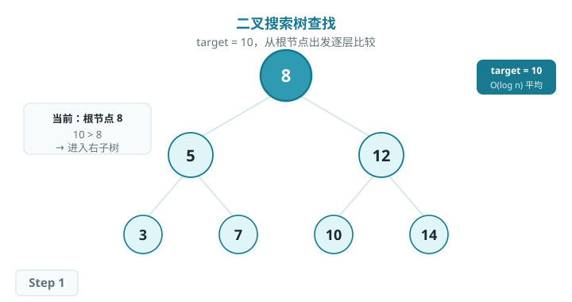

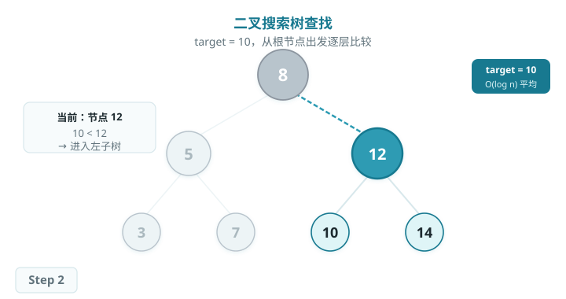

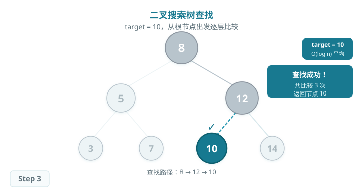

### BST 插入

插入新关键字时，先按查找逻辑找到其应插入的位置（空节点处），再创建新节点挂接。插入后仍满足 BST 性质。

#### 插入过程模拟

向 BST 中插入 `key = 6`：

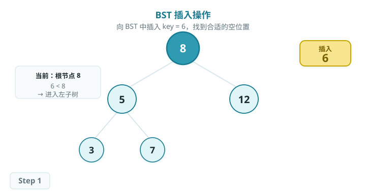

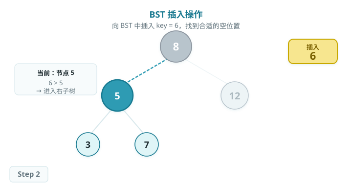

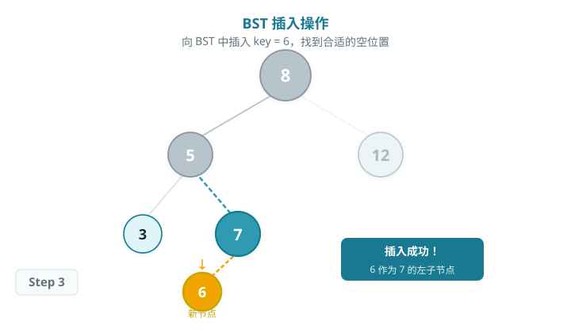

### BST 删除

删除分三种情况：

1. **叶节点：**直接删除。
2. **只有一个子节点：**用子节点替代被删节点。
3. **有两个子节点：**用中序后继（右子树最左节点）替换，再删除该后继。

#### 删除过程模拟

删除节点 `5`（有两个子节点 3、7）：

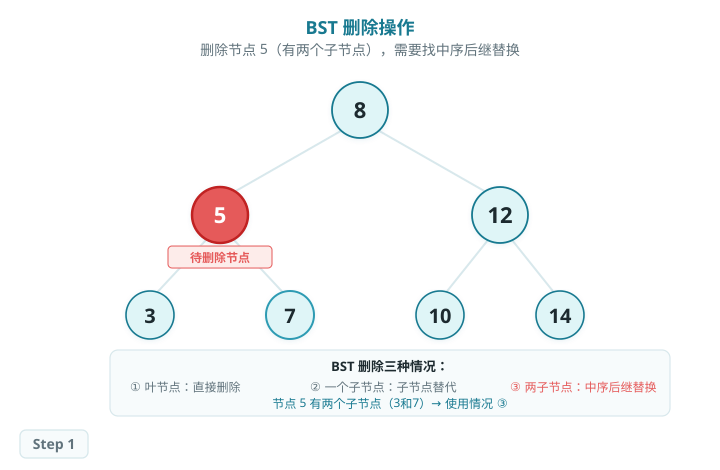

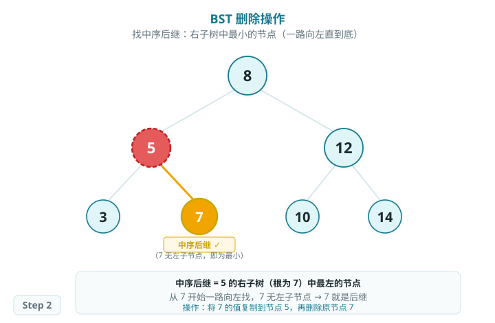

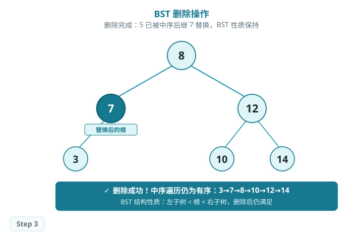

### 算法特性

- **时间复杂度：**平均 O(log n)；最坏情况（退化为链表）O(n)。
- **空间复杂度：O(n)，**每个元素对应一个节点。
- **中序遍历：**始终得到有序序列，可用于验证 BST 结构正确性。
- **退化问题：**按有序序列插入导致树退化为链表；AVL 树和红黑树通过旋转避免此问题。

### Baseline 任务：BST 实现

#### 任务内容

完成 `bst_avl.cpp`，实现以下 BST 功能：

1. **BST 插入** `void insert(int key)`
    - 保持左子树关键字小于根、右子树关键字大于根
2. **BST 查找** `bool search(int key)`
    - 返回目标关键字是否存在
3. **BST 删除** `void remove(int key)`
    - 处理三种删除情况，保持 BST 性质
4. **中序遍历** `void inorder()`
    - 输出有序序列用于验证

#### 文件结构

- `bst_avl.h`：BST 与 AVL 树接口声明
- `bst_avl.cpp`：核心实现
- `test.cpp`：测试程序

#### 验证方式

- 编译：`g++ -std=c++17 test.cpp bst_avl.cpp -o testBSTAVL`
- 运行：`./testBSTAVL`

## AVL 树（Adelson-Velsky-Landis Tree）

> AVL 树是在 BST 基础上加入平衡约束的自平衡二叉搜索树：任意节点的左右子树高度差（平衡因子 bf）的绝对值不超过 1。
>
> 当插入或删除节点导致 |bf| > 1 时，通过旋转操作恢复平衡，从而保证树高始终为 O(log n)，避免 BST 退化。

### 平衡因子（Balance Factor）

每个节点的 **平衡因子 bf = 左子树高度 − 右子树高度**。AVL 树要求所有节点 |bf| ≤ 1。插入或删除后，从叶节点到根逐层回溯更新 bf，一旦发现 |bf| = 2，立即在该节点执行旋转。

### 旋转操作

#### LL 型右旋（过程模拟）

以插入 `1` 导致节点 `5` 的 bf=2 为例，展示 LL 型调整的完整过程：

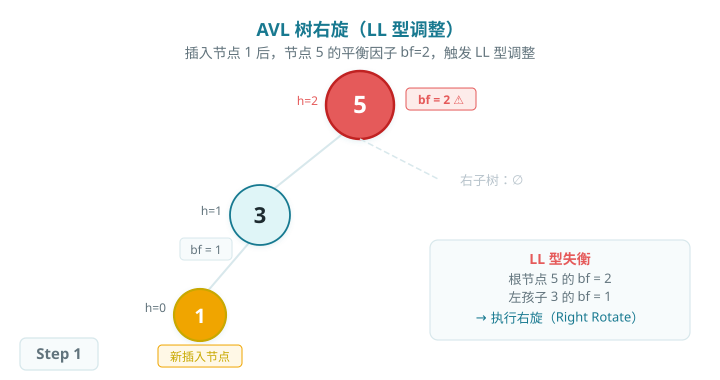

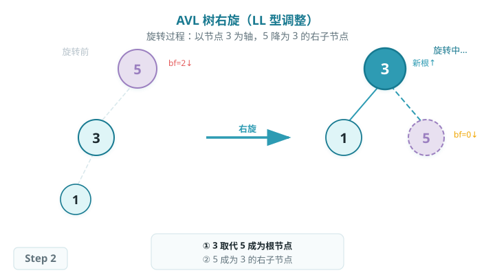

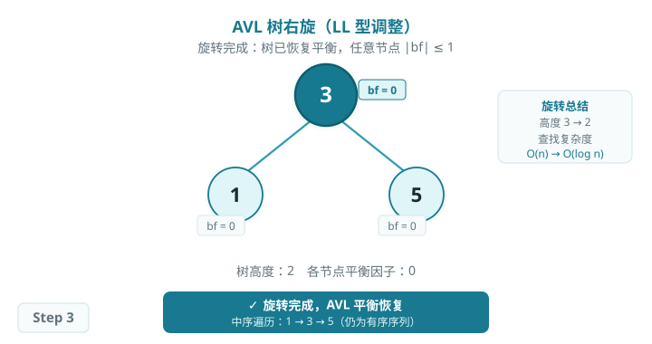

#### 四种失衡类型

根据失衡节点和新插入节点的相对位置，共有四种旋转：

| 失衡类型 | 条件 | 操作 |
| --- | --- | --- |
| LL 型 | 失衡节点 bf=2，左孩子 bf=1 | 对失衡节点右旋（Right Rotate） |
| RR 型 | 失衡节点 bf=-2，右孩子 bf=-1 | 对失衡节点左旋（Left Rotate） |
| LR 型 | 失衡节点 bf=2，左孩子 bf=-1 | 先对左孩子左旋，再对失衡节点右旋 |
| RL 型 | 失衡节点 bf=-2，右孩子 bf=1 | 先对右孩子右旋，再对失衡节点左旋 |

### 算法特性

- **时间复杂度：O(log n)**，旋转后树高严格为 O(log n)，查找、插入、删除均保证。
- **旋转代价：**每次插入/删除最多执行 O(log n) 次旋转（通常仅 1~2 次）。
- **与 BST 对比：**避免了退化为链表的最坏情况，代价是旋转开销。
- **与红黑树对比：**AVL 更严格平衡，查找性能略优；红黑树插入/删除旋转次数少，实际应用更广。

### Baseline 任务：AVL 树实现

#### 任务内容

完成 `bst_avl.cpp`，在 BST 基础上实现以下 AVL 功能：

1. **旋转操作**
    - 实现 LL（右旋）、RR（左旋）、LR（先左后右）、RL（先右后左）四种旋转
2. **AVL 插入**
    - 插入后回溯更新平衡因子，发现失衡时执行对应旋转
3. **AVL 删除**
    - 删除后同样需要回溯并修复失衡

#### 验证方式

- 编译：`g++ -std=c++17 test.cpp bst_avl.cpp -o testBSTAVL`
- 运行：`./testBSTAVL`
