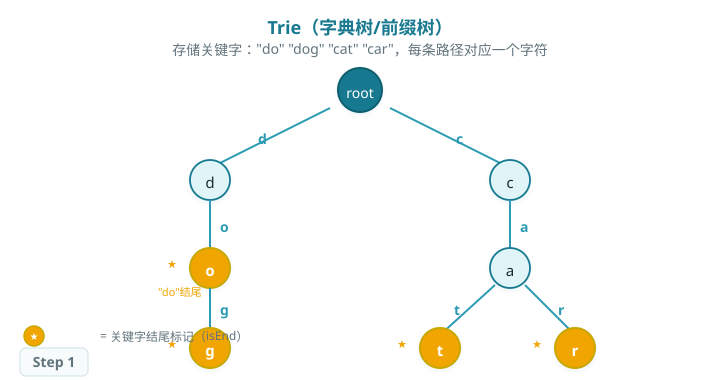
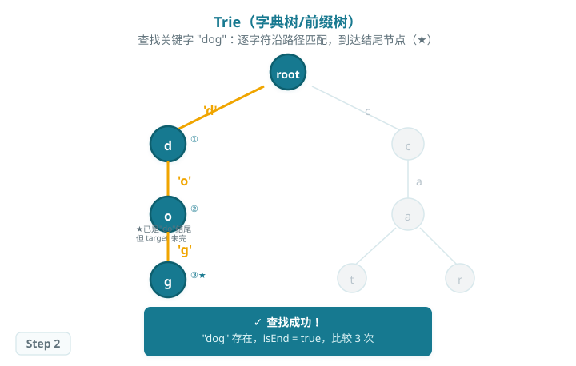
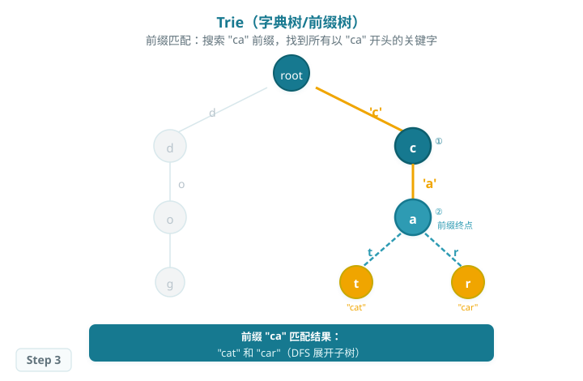

# Trie（字典树 / 前缀树）

> Trie 是一种专为字符串关键字设计的树形结构：每条从根到叶子的路径对应一个完整关键字，路径上的每条边标注一个字符。
>
> Trie 的查找时间复杂度仅与目标字符串长度有关（O(m)，m 为字符串长度），与存储的关键字数量无关，天然支持前缀匹配，适合词典检索、自动补全等场景。

## 结构与操作

### 结构示意

存储关键字集合 `{"do", "dog", "cat", "car"}`，每条路径对应一个字符串。橙色标注节点表示关键字在此结束（`isEnd = true`）：

### 查找过程

查找关键字 `word` 的步骤：

1. 从根节点出发，逐字符沿边向下匹配。
2. 若某字符对应的子节点不存在，返回 `false`（路径中断）。
3. 若所有字符均匹配，检查最后节点的 `isEnd`：为 `true` 则查找成功，否则该字符串只是某关键字的前缀。

### 前缀匹配

前缀查询 `prefix` 的步骤与查找相同，但最后无需检查 `isEnd`，只要路径能走完即表示存在该前缀。再对该节点做 DFS 或 BFS，即可枚举所有以 `prefix` 开头的关键字。

## 算法特性

- **查找时间复杂度：O(m)，**m 为目标字符串长度，与关键字总数无关。
- **空间复杂度：O(n × m)，**n 为关键字数量，m 为平均长度；前缀共享可大幅节省空间。
- **天然前缀索引：**路径本身即是前缀索引，无需额外构造。
- **适合场景：**词典检索、自动补全、路由表最长前缀匹配、字符串排序。

| 操作 | 时间复杂度 | 说明 |
| --- | --- | --- |
| 插入 | O(m) | 逐字符创建/沿用节点 |
| 精确查找 | O(m) | 需检查 isEnd |
| 前缀查找 | O(m) | 无需检查 isEnd |
| 删除 | O(m) | 删除不再共享的尾部节点 |

## Baseline 任务：Trie 实现

### 任务内容

完成 `trie.cpp`，实现以下功能：

1. **Trie 插入**
    - 按字符逐层构造路径，支持字符串关键字的逐字符存储
2. **Trie 查找**
    - 支持完整关键字查找（检查 isEnd）
    - 支持前缀匹配判断（路径能走完即可）
3. **Trie 删除**
    - 删除不再使用的尾部路径，保留被其他关键字共享的节点

### 文件结构

- `trie.h`：Trie 接口声明
- `trie.cpp`：核心实现
- `test.cpp`：测试程序

### 验证方式

- 编译：`g++ -std=c++17 test.cpp trie.cpp -o testTrie`
- 运行：`./testTrie`
