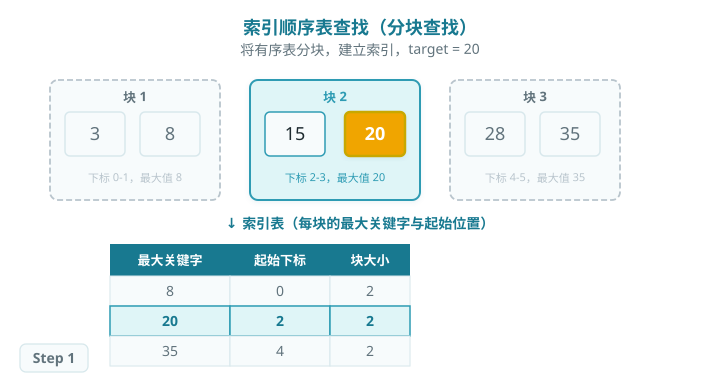
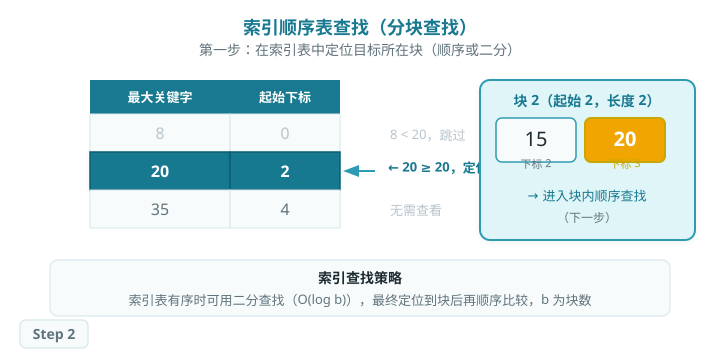
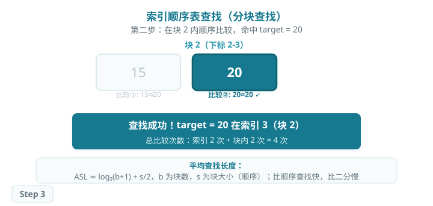

# 索引顺序表查找（分块查找）

> 索引顺序查找（分块查找）将线性表分成若干块，并为每块建立索引项，记录该块的最大关键字和起始位置。查找时先在索引表中定位目标所在的块，再在块内顺序比较。
>
> 分块查找是顺序查找与二分查找的折中：比顺序查找快，比二分查找对数据的要求低（块间有序，块内无序即可）。

## 查找过程

### 结构说明

将数组 `[3, 8, 15, 20, 28, 35]` 分成 3 块，建立索引表：

### 索引定位块

索引表中每项记录一个块的最大关键字与起始位置。查找索引时：

- 可以**顺序查找**索引表：找到第一个 `maxKey ≥ target` 的块。
- 也可以**二分查找**索引表（若索引表有序）：时间 O(log b)，b 为块数。

### 块内顺序查找

定位到块后，从块的起始位置顺序比较，直到找到 target 或超出块边界。

## ASL 分析

设 n 个元素分成 b 块，每块大小 s = n/b：

- **顺序查找索引：**ASL = (b+1)/2 + (s+1)/2
- **二分查找索引：**ASL ≈ log₂(b+1) + (s+1)/2
- 最优块大小（顺序索引）：s = √n，此时 ASL ≈ √n + 1

| 查找方法 | 时间复杂度 | 数据要求 |
| --- | --- | --- |
| 顺序查找 | O(n) | 无序 |
| 分块查找（顺序索引） | O(√n) | 块间有序，块内无序 |
| 二分查找 | O(log n) | 全序 |

## 算法特性

- **时间复杂度：**O(√n)（顺序索引最优块大小时），介于顺序查找与二分查找之间。
- **块内无序：**块内元素不要求有序，插入新元素只需追加到对应块末尾，灵活性强。
- **适合动态场景：**插入时在块内直接追加，定期重建索引即可，维护代价低。

## Baseline 任务：索引顺序表构造与查找

### 任务内容

完成 `indexed_sequential_search.cpp`，实现以下函数：

1. **索引构造**
    - 将有序表按块划分
    - 为每个块建立索引项，记录最大关键字、起始位置和块长度
2. **索引顺序查找**
    - 先在索引表中定位目标关键字所在块
    - 再在线性块内完成顺序比较

### 文件结构

- `indexed_sequential_search.h`：接口声明
- `indexed_sequential_search.cpp`：核心实现
- `test.cpp`：测试程序

### 验证方式

- 编译：`g++ -std=c++17 test.cpp indexed_sequential_search.cpp -o testIndexedSequentialSearch`
- 运行：`./testIndexedSequentialSearch`
