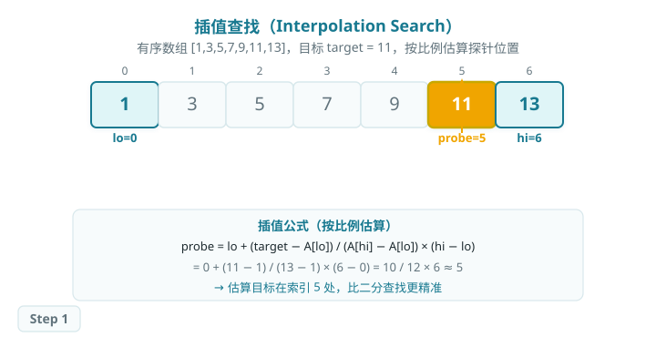
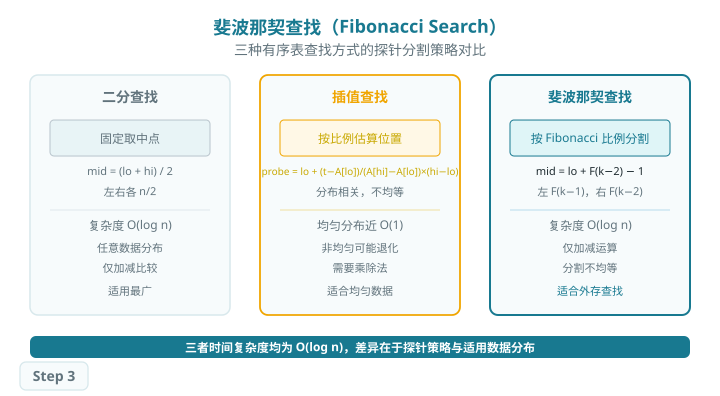

# 有序表查找

## 二分查找（Binary Search）

> 二分查找每次取区间中点元素与目标进行比较，无论结果如何，都能将搜索区间缩小一半，从而在 O(log n) 时间内完成查找。
>
> 前提：数组必须有序且支持随机访问（顺序存储结构）。

### 查找过程

每次取区间 `[lo, hi]` 的中点 `mid = (lo + hi) / 2` 进行比较：

- 若 `A[mid] = target`，查找成功；
- 若 `A[mid] < target`，在右半区间继续（`lo = mid + 1`）；
- 若 `A[mid] > target`，在左半区间继续（`hi = mid - 1`）；
- 区间为空（`lo > hi`）则查找失败。

#### 过程模拟

以有序数组 `[1, 3, 5, 7, 9, 11, 13]`、目标 `target = 11` 为例：

![步骤 1：lo=0, hi=6, mid=3，A[3]=7 < 11，令 lo=4](../../../../../Pages/assets/images/search/binary_search_step1.svg)

![步骤 2：lo=4, hi=6, mid=5，A[5]=11 = target，查找成功！](../../../../../Pages/assets/images/search/binary_search_step2.svg)

#### 左右边界与插入点

当数组中存在重复元素，或需要确定插入位置时，需要使用二分的边界变体：

- **左边界查找：**找到 target 后不立即返回，令 `hi = mid - 1` 继续向左收缩，直至区间为空；最终 `lo` 即为首次出现位置。
- **右边界查找：**找到 target 后令 `lo = mid + 1` 继续向右收缩；最终 `hi` 即为末次出现位置。
- **插入位置：**当 target 不存在时，`lo` 即为维持有序的应插入位置。

### 算法特性

- **时间复杂度：O(log n)。**每次比较缩小一半，最多比较 ⌈log₂(n+1)⌉ 次。
- **空间复杂度：O(1)。**迭代实现只需常数额外空间；递归实现为 O(log n) 栈空间。
- **前提条件：**数组必须有序且支持 O(1) 随机访问（不适用链表）。
- **稳定查找：**通过边界变体可精确定位重复元素的首次或末次出现位置。

### Baseline 任务：二分查找

#### 任务内容

完成 `ordered_search.cpp`，实现以下函数：

1. **基础二分查找** `int BinarySearch(vector<int>& nums, int target)`
    - 在有序表中查找目标关键字，返回下标或 -1
2. **左边界查找** `int BinarySearchLeftBound(vector<int>& nums, int target)`
    - 返回 target 首次出现的下标
3. **右边界查找** `int BinarySearchRightBound(vector<int>& nums, int target)`
    - 返回 target 末次出现的下标
4. **插入位置查找** `int BinarySearchInsertionPoint(vector<int>& nums, int target)`
    - 返回 target 应插入的位置，使数组保持有序

#### 文件结构

- `ordered_search.h`：函数声明
- `ordered_search.cpp`：查找算法核心实现
- `test.cpp`：测试程序

#### 验证方式

- 编译：`g++ -std=c++17 test.cpp ordered_search.cpp -o testOrderedSearch`
- 运行：`./testOrderedSearch`

## 插值查找（Interpolation Search）

> 插值查找是二分查找的改进：不固定取中点，而是根据目标值与区间端点的比例关系，估算目标可能所在的位置。
>
> 当数据均匀分布时，插值查找期望 O(log log n) 次探针，远优于二分查找的 O(log n)。

### 查找过程

#### 插值公式

设有序数组 `A[lo..hi]`，目标 `target`，插值探针位置按以下公式估算：

> `probe = lo + (target − A[lo]) / (A[hi] − A[lo]) × (hi − lo)`

若 `A[probe] = target`，查找成功；若 `A[probe] < target`，在右半部分继续；否则在左半部分继续。这与二分查找的区别仅在于 probe 的计算方式：二分固定取 `(lo+hi)/2`，插值按"比例"动态估算。

#### 过程模拟

以有序数组 `[1, 3, 5, 7, 9, 11, 13]`、目标 `target = 11` 为例：

![步骤 2：A[5]=11=target，一次探针直接命中](../../../../../Pages/assets/images/search/interpolation_search_step2.svg)

### 算法特性

- **时间复杂度：**均匀分布时期望 O(log log n)；最坏情况（极端非均匀分布）退化至 O(n)。
- **空间复杂度：O(1)，原地查找。**
- **前提条件：**必须是有序数组；数据分布越均匀，探针越精准。
- **与二分对比：**均匀数据中插值往往一次命中；非均匀数据中二分更稳定。

| 算法 | 探针位置 | 均匀分布 | 非均匀分布 |
| --- | --- | --- | --- |
| 二分查找 | (lo+hi)/2，固定取中 | O(log n) | O(log n) |
| 插值查找 | 按比例估算，动态 | O(log log n) | 最坏 O(n) |

### Baseline 任务：插值查找

#### 任务内容

完成 `ordered_search.cpp`，实现以下函数：

1. **插值查找** `int InterpolationSearch(vector<int>& nums, int target)`
    - 根据关键字分布估计查找位置，适用于分布较均匀的数据
    - 返回目标所在下标，未找到返回 -1
    - 注意 `A[hi] == A[lo]` 时的边界处理（避免除以零）

#### 文件结构

- `ordered_search.h`：函数声明
- `ordered_search.cpp`：有序表查找核心实现
- `test.cpp`：测试程序，验证查找功能正确性

#### 验证方式

- 编译：`g++ -std=c++17 test.cpp ordered_search.cpp -o testOrderedSearch`
- 运行：`./testOrderedSearch`

## 斐波那契查找（Fibonacci Search）

> 斐波那契查找利用斐波那契数列对有序表进行不等比例分割，从而定位目标关键字。与二分查找不同，它将区间分成 F(k-1) 和 F(k-2) 两部分，仅需加减运算，适合外存访问场景。

### 查找过程

#### Fibonacci 分割原理

斐波那契数列：1, 1, 2, 3, 5, 8, 13, 21, …，其中 `F(k) = F(k-1) + F(k-2)`。

对于大小为 n 的有序数组，找到最小的 k 使得 `F(k) ≥ n`，将数组补充到 F(k) 大小（末尾补最大值）。每次分割：

- 探针位置：`probe = lo + F(k-2) - 1`
- 若 `A[probe] < target`：在右半（F(k-2) 个元素）继续，k = k-2
- 若 `A[probe] > target`：在左半（F(k-1) 个元素）继续，k = k-1
- 若相等：查找成功

#### 过程模拟

以有序数组 `[1, 3, 5, 7, 9, 11, 13]`（n=7）、目标 `target = 11` 为例，F(6)=8≥7：

![步骤 1：第一次 Fibonacci 分割，probe=F(5)-1=4，A[4]=9＜11 → 查右半](../../../../../Pages/assets/images/search/fibonacci_search_step1.svg)

![步骤 2：右半 [11,13]，probe=5，A[5]=11=target，查找成功](../../../../../Pages/assets/images/search/fibonacci_search_step2.svg)

#### 三种有序表查找策略对比

| 算法 | 探针计算 | 运算 | 时间复杂度 | 适用场景 |
| --- | --- | --- | --- | --- |
| 二分查找 | (lo+hi)/2 固定取中 | 加、除 | O(log n) | 任意有序数组 |
| 插值查找 | 按关键字比例估算 | 加、乘、除 | 均匀 O(log log n) | 均匀分布数据 |
| 斐波那契查找 | F(k-2)-1 偏左分割 | 仅加减 | O(log n) | 外存/硬件加速 |

### 算法特性

- **时间复杂度：O(log n)，**与二分查找同阶，常数略有差异。
- **空间复杂度：O(1)，**需预先生成 Fibonacci 数列（常数大小）。
- **仅需加减运算：**避免乘除法，适合乘除开销大的硬件环境。
- **需要补全数组：**将数组补到 F(k) 大小，增加少量空间但不影响正确性。

### Baseline 任务：斐波那契查找

#### 任务内容

完成 `ordered_search.cpp`，实现以下函数：

1. **斐波那契查找** `int FibonacciSearch(vector<int>& nums, int target)`
    - 利用斐波那契分割思想完成关键字定位
    - 将原数组补充至 F(k) 大小后在区间内迭代
    - 返回目标所在原数组下标，未找到返回 -1

#### 文件结构

- `ordered_search.h`：函数声明
- `ordered_search.cpp`：有序表查找核心实现
- `test.cpp`：测试程序

#### 验证方式

- 编译：`g++ -std=c++17 test.cpp ordered_search.cpp -o testOrderedSearch`
- 运行：`./testOrderedSearch`
