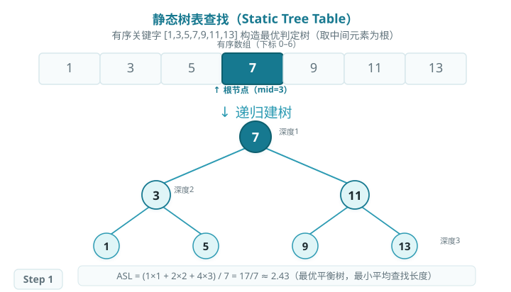
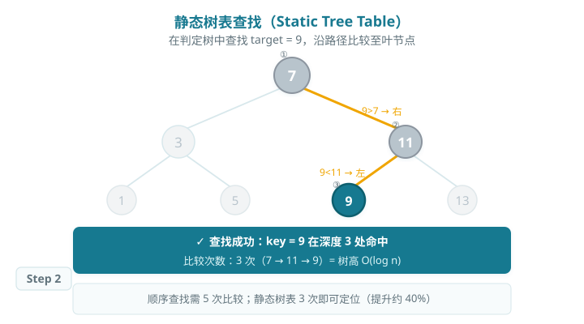

# 静态树表查找（Static Tree Table）

> 静态树表将有序关键字集合组织成最优判定树，通过树形路径完成查找。与普通二分查找相比，静态树表在频次不均等的查找场景下能最小化平均查找长度（ASL）。
>
> 对于等概率查找，最优静态树即完全平衡二叉搜索树；各元素查找概率不同时，可通过动态规划构造最优判定树。

## 判定树构造与查找

### 结构与构造

对有序关键字集合 `{1, 3, 5, 7, 9, 11, 13}`（等概率查找），构造最优静态树表：

1. 取中间元素 `7`（下标 3）作为根节点。
2. 递归地在左半 `{1, 3, 5}` 中取 `3` 为根，在右半 `{9, 11, 13}` 中取 `11` 为根。
3. 依此递归，形成完全平衡二叉搜索树。

### 查找路径

在静态树表中查找关键字 `k` 的过程与 BST 查找完全相同：

- 若 `k = root`，查找成功；
- 若 `k < root`，进入左子树继续；
- 若 `k > root`，进入右子树继续；
- 若到达空节点仍未找到，查找失败。

## ASL 分析

对于 n=7 的完全平衡树，每个节点深度如下：

- 深度 1：1 个节点（根 7）
- 深度 2：2 个节点（3, 11）
- 深度 3：4 个节点（1, 5, 9, 13）

**ASL = (1×1 + 2×2 + 4×3) / 7 = 17/7 ≈ 2.43**，为等概率条件下的最优平均查找长度。

## 算法特性

- **时间复杂度：O(log n)，**等同于对有序数组的二分查找。
- **构造一次，多次查找：**建树时间 O(n)，之后每次查找 O(log n)。
- **静态结构：**不支持动态插入/删除，数据集固定时最优。
- **非等概率优化：**可用动态规划构造最优判定树（Knuth 算法），使带权 ASL 最小。

## Baseline 任务：静态树表构造与查找

### 任务内容

完成 `static_tree_table.cpp`，实现以下函数：

1. **构造静态树表**
    - 基于有序关键字递归选取中间元素建树
    - 使查找路径尽量均衡，降低平均查找长度
2. **静态树表查找**
    - 按树形路径定位目标关键字
    - 返回是否命中、节点位置和比较次数

### 文件结构

- `static_tree_table.h`：接口声明
- `static_tree_table.cpp`：核心实现
- `test.cpp`：测试程序

### 验证方式

- 编译：`g++ -std=c++17 test.cpp static_tree_table.cpp -o testStaticTreeTable`
- 运行：`./testStaticTreeTable`
