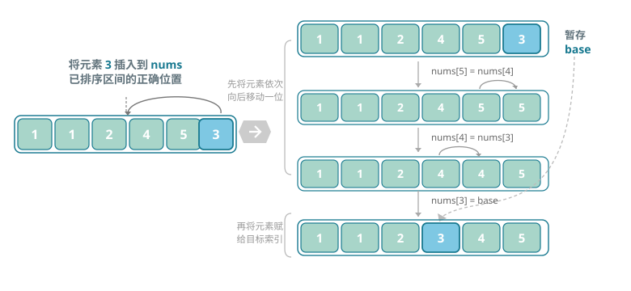
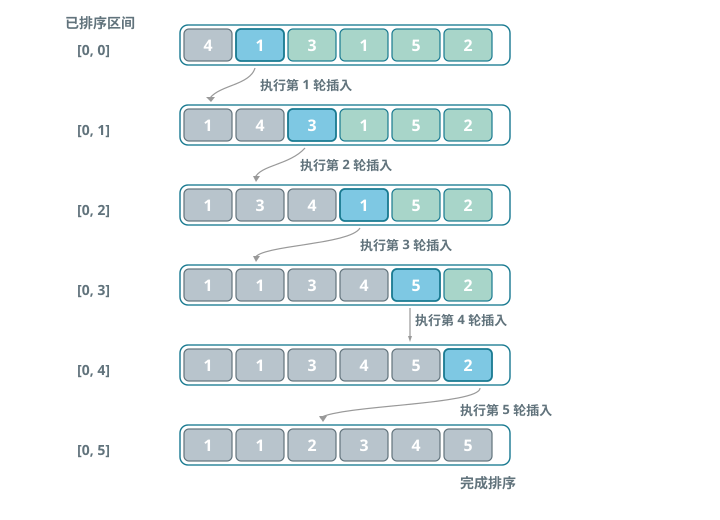

# 直接插入排序（Insertion Sort）

> 插入排序是一种简单的排序算法，它的工作原理与手动整理一副牌的过程非常相似。

## 单次插入操作

具体来说，我们在未排序区间选择一个基准元素，将该元素与其左侧已排序区间的元素逐一比较大小，并将该元素插入到正确的位置。

下图展示了数组插入元素的操作流程。设基准元素为 base，我们需要将从目标索引到 base 之间的所有元素向右移动一位，然后将 base 赋值给目标索引。

*单次插入操作示意图*

## 算法流程

插入排序的整体流程如图所示。

1. 初始状态下，数组的第 1 个元素已完成排序。
2. 选取数组的第 2 个元素作为 base，将其插入到正确位置后，数组的前 2 个元素已排序。
3. 选取第 3 个元素作为 base，将其插入到正确位置后，数组的前 3 个元素已排序。
4. 以此类推，在最后一轮中，选取最后一个元素作为 base，将其插入到正确位置后，所有元素均已排序。

*插入排序整体流程*

## 算法特性

- **时间复杂度为 O(n²)、自适应排序：**在最差情况下，每次插入操作分别需要循环 n-1、n-2、...、2、1 次，求和得到 (n-1)n/2，因此时间复杂度为 O(n²)。在遇到有序数据时，插入操作会提前终止。当输入数组完全有序时，插入排序达到最佳时间复杂度 O(n)。
- **空间复杂度为 O(1)、原地排序：**指针 i 和 j 使用常数大小的额外空间。
- **稳定排序：**在插入操作过程中，我们会将元素插入到相等元素的右侧，不会改变它们的顺序。

## Baseline 任务 1：插入排序的基础实现

### 任务内容

完成 InsertSort.cpp，实现插入排序：

- 从数组第二个元素开始，逐个将元素插入到前面已排序序列的正确位置
- 对输入的整型数组进行**原地升序排序**
- 时间复杂度：最坏 O(n²)，最好 O(n)
- 空间复杂度：O(1)

### 验证方式

- 编译：`g++ testInsertSort.cpp InsertSort.cpp -o testInsertSort`
- 运行：`./testInsertSort`

## Baseline 任务 2：插入排序算法的优化

> 在实践中，我们会发现插入排序存在明显的短板：例如，在寻找插入位置时需要逐个比较，效率较低；或者在移动元素时需要频繁交换位置，导致操作次数较多。
>
> 这些问题都指向了一个方向：插入排序还有很大的优化空间。

### 任务内容：二分插入排序（优化查找过程）

传统的直接插入排序在寻找元素插入位置时，采用从后往前逐个比较的方式，比较次数较多。尝试实现二分插入排序：

- **核心思想：**在有序区间内使用二分查找来快速定位插入位置，减少比较次数，提升查找效率。
- **要求：**
    1. 实现 `void BinaryInsertSort(vector<int>& arr)` 函数。
    2. 编写测试程序，验证该算法在不同场景下的正确性（如随机数组、有序数组、逆序数组）。
    3. 分析其与简单插入排序的时间复杂度对比（理论与实际运行时间），并解释其改进点。

### 文件结构

- `InsertSort.h`：插入排序函数声明，带头文件保护
- `InsertSort.cpp`：插入排序核心算法实现
- `testInsertSort.cpp`：测试程序，验证排序功能正确性
