# 归并排序（Merge Sort）

## 算法概述

> 归并排序是一种基于分治策略的排序算法，包含"划分"和"合并"两个阶段。

1. **划分阶段：**通过递归不断地将数组从中点处分开，将长数组的排序问题转换为短数组的排序问题。
2. **合并阶段：**当子数组长度为 1 时终止划分，开始合并，持续地将左右两个较短的有序数组合并为一个较长的有序数组，直至结束。

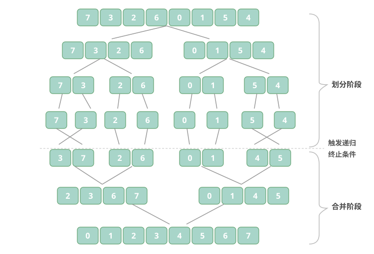

## 算法流程

如图所示，"划分阶段"从顶至底递归地将数组从中点切分为两个子数组。

1. 计算数组中点 mid，递归划分左子数组（区间 [left, mid]）和右子数组（区间 [mid + 1, right]）。
2. 递归执行步骤 1，直至子数组区间长度为 1 时终止。

"合并阶段"从底至顶地将左子数组和右子数组合并为一个有序数组。需要注意的是，从长度为 1 的子数组开始合并，合并阶段中的每个子数组都是有序的。

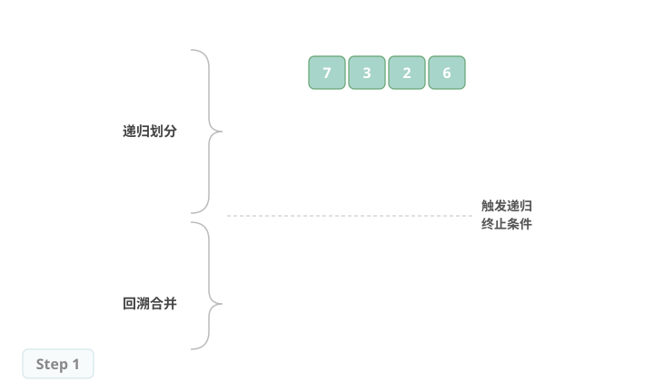

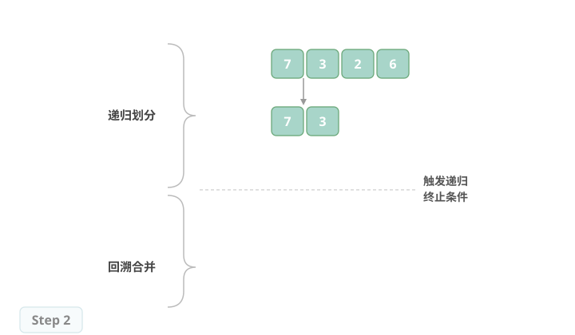

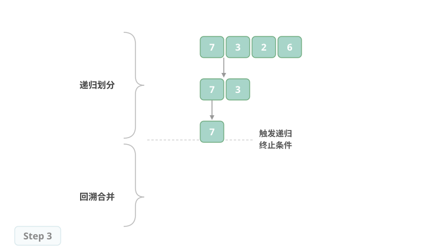

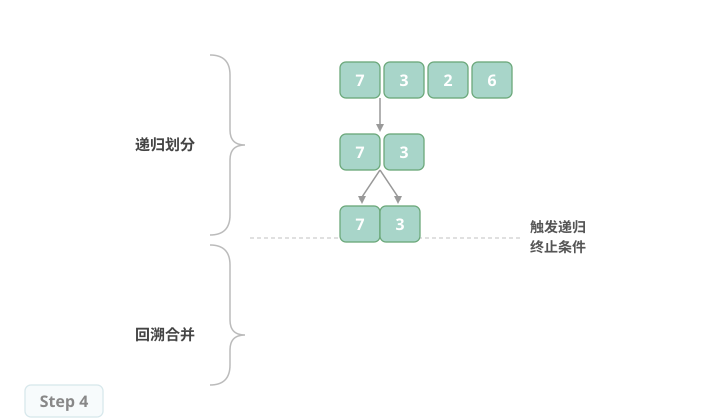

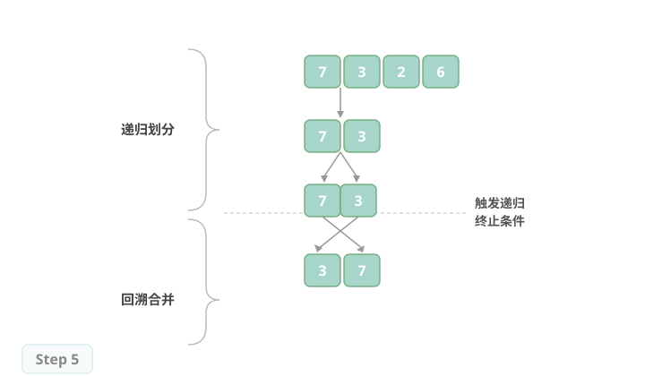

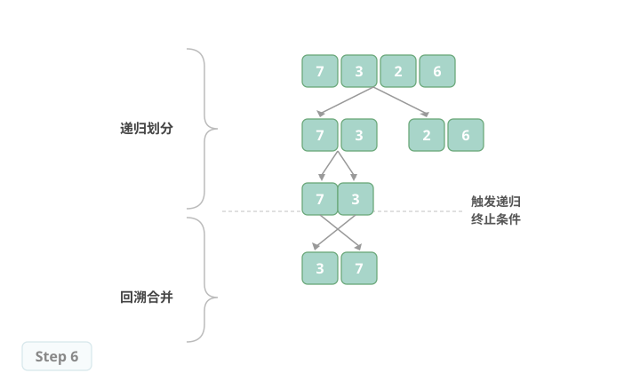

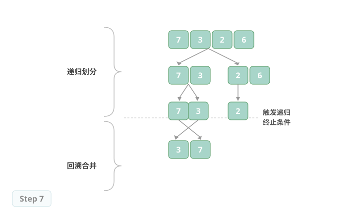

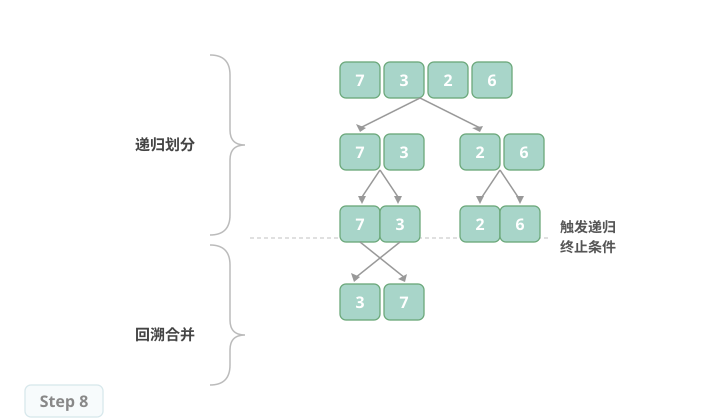

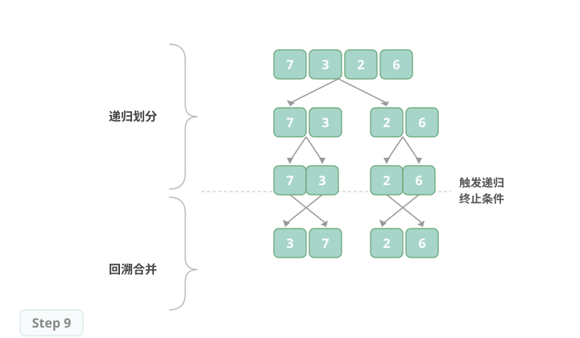

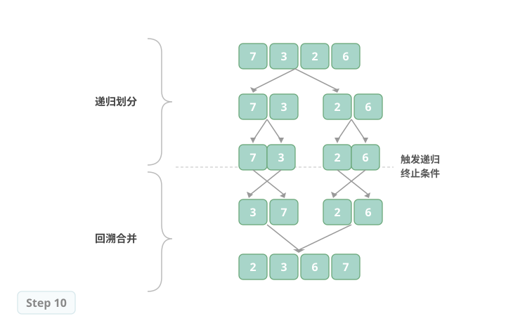

观察发现，归并排序与二叉树后序遍历的递归顺序是一致的。

- 后序遍历：先递归左子树，再递归右子树，最后处理根节点。
- 归并排序：先递归左子数组，再递归右子数组，最后处理合并。

## 算法特性

- **时间复杂度为 O(n log n)、非自适应排序：**划分产生高度为 log n 的递归树，每层合并的总操作数量为 n，因此总体时间复杂度为 O(n log n)。
- **空间复杂度为 O(n)、非原地排序：**递归深度为 log n，使用 O(log n) 大小的栈帧空间。合并操作需要借助辅助数组实现，使用 O(n) 大小的额外空间。
- **稳定排序：**在合并过程中，相等元素的次序保持不变。

## Baseline 任务 1：2 路归并排序的基础实现

### 任务内容

完成 MergeSort.cpp，实现 2 路归并排序（递归）：

- 采用分治思想，先拆分再合并
- 递归将数组分成左右两部分，分别排序
- 合并两个有序子数组得到最终结果
- 时间复杂度：O(n log n)
- 空间复杂度：O(n)
- 稳定排序

### 验证方式

- 编译：`g++ testMergeSort.cpp MergeSort.cpp -o testMergeSort`
- 运行：`./testMergeSort`

## Baseline 任务 2：归并排序算法的优化

### 任务内容：原地归并排序与链表归并排序优化

传统数组版归并排序需要 O(n) 的额外空间，而链表结构可以实现 O(1) 空间复杂度的归并排序；同时也可以尝试优化数组归并的空间使用。

- **核心思想：**
    - 对于数组：尝试实现基于"原地合并"的优化版本，减少辅助数组的空间开销；
    - 对于链表：实现迭代版链表归并排序，无需递归栈空间，合并阶段仅通过修改指针完成，空间复杂度优化至 O(1)。
- **要求：**
    1. 实现链表节点结构 `ListNode`，并完成迭代版 `ListNode* mergeSortList(ListNode* head)` 函数。
    2. 编写测试程序，验证链表归并排序的正确性，并对比数组版与链表版的空间使用差异。
    3. 分析链表归并排序的优势与适用场景。

### 文件结构

- `MergeSort.h`：归并排序函数声明
- `MergeSort.cpp`：归并排序核心算法实现
- `testMergeSort.cpp`：测试程序，验证排序功能正确性
