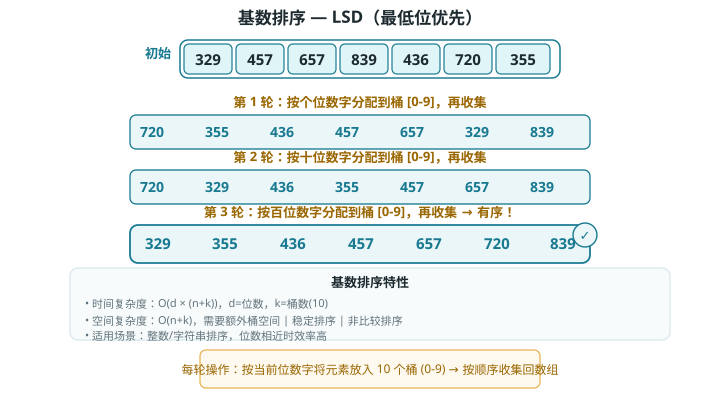

# 基数排序（Radix Sort）

> 基数排序的核心思想是通过统计个数来实现排序。在此基础上，基数排序利用数字各位之间的递进关系，依次对每一位进行排序，从而得到最终的排序结果。

## 算法流程

以学号数据为例，假设数字的最低位是第 1 位，最高位是第 8 位，基数排序的流程如图所示。

### 排序原理

1. 初始化位数 k=1。
2. 对学号的第 k 位执行"计数排序"。完成后，数据会根据第 k 位从小到大排序。
3. 将 k 增加 1，然后返回步骤 2 继续迭代，直到所有位都排序完成后结束。

*基数排序整体流程*

### 计算公式

下面剖析代码实现。对于一个 d 进制的数字 x，要获取其第 k 位 xk，可以使用以下计算公式：

为什么从最低位开始排序？在连续的排序轮次中，后一轮排序会覆盖前一轮排序的结果。举例来说，如果第一轮排序结果 a < b，而第二轮排序结果 a > b，那么第二轮的结果将取代第一轮的结果。由于数字的高位优先级高于低位，因此应该先排序低位再排序高位。

## 算法特性

相较于计数排序，基数排序适用于数值范围较大的情况，但前提是数据必须可以表示为固定位数的格式，且位数不能过大。例如，浮点数不适合使用基数排序，因为其位数 k 过大，可能导致时间复杂度 O(nk) >> O(n²)。

- **时间复杂度为 O(nk)、非自适应排序：**设数据量为 n、数据为 d 进制、最大位数为 k，则对某一位执行计数排序使用 O(n+d) 时间，排序所有 k 位使用 O((n+d)k) 时间。通常情况下，d 和 k 都相对较小，时间复杂度趋向 O(n)。
- **空间复杂度为 O(n+d)、非原地排序：**与计数排序相同，基数排序需要借助长度为 n 和 d 的数组 res 和 counter。
- **稳定排序：**当计数排序稳定时，基数排序也稳定；当计数排序不稳定时，基数排序无法保证得到正确的排序结果。

## Baseline 任务 1：基数排序的基础实现

### 任务内容

完成 RadixSort.cpp，实现基数排序：

- 基于低位优先、桶思想分配与回收
- 先求数组最大位数，依次按个位、十位、百位…排序
- 非原地排序，稳定排序
- 时间复杂度：O(d*n)
- 空间复杂度：O(n)

### 验证方式

- 编译：`g++ testRadixSort.cpp RadixSort.cpp -o testRadixSort`
- 运行：`./testRadixSort`

## Baseline 任务 2：基数排序算法的优化

### 任务内容：负数支持优化（正负分离基数排序）

传统基数排序只能处理非负整数，无法直接对包含负数的数组排序。尝试实现支持负数的优化版本：

- **核心思想：**将数组按正负分离，分别排序后再合并；负数取绝对值排序后反转，最终实现完整的整数排序。
- **要求：**
    1. 实现 `void radixSortWithNegative(vector<int>& arr)` 函数。
    2. 编写包含正负数混合、全正、全负三种测试用例。
    3. 分析空间开销与时间复杂度变化。

### 文件结构

- `RadixSort.h`：基数排序函数声明
- `RadixSort.cpp`：基数排序核心算法实现
- `testRadixSort.cpp`：测试程序，验证排序功能正确性
