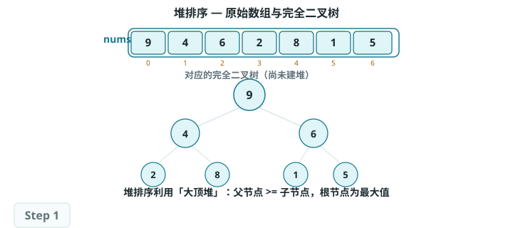
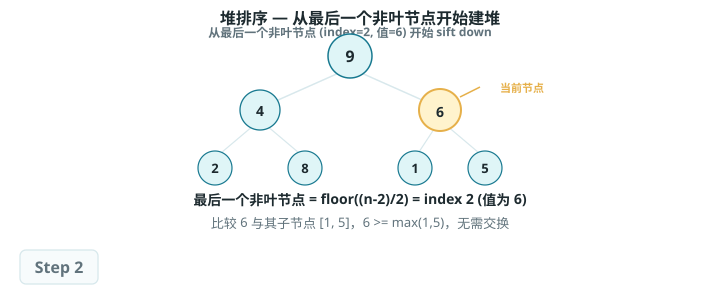
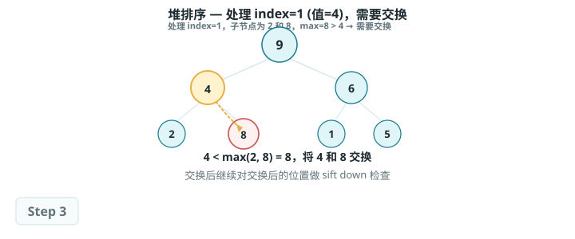
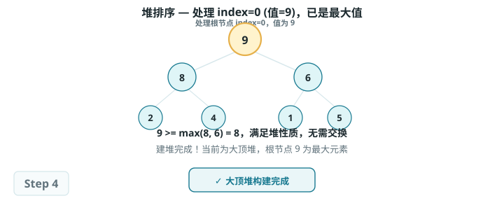
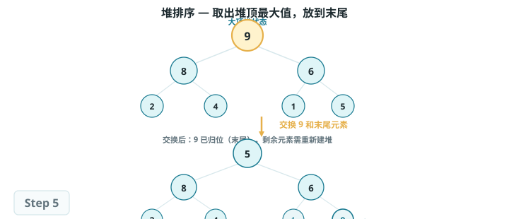
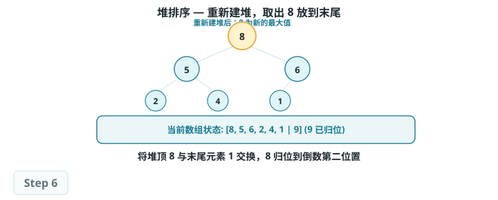
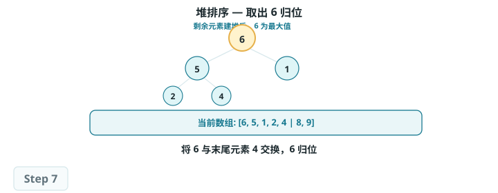
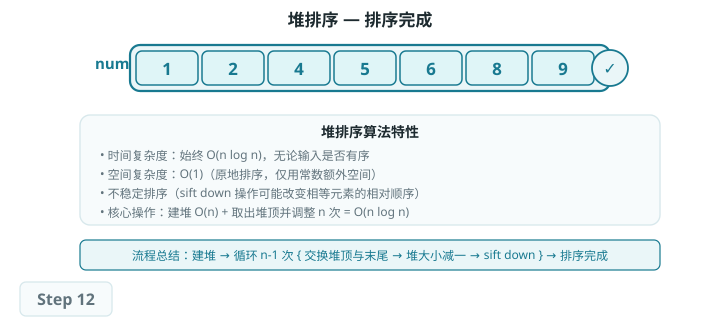

# 堆排序（Heap Sort）

## 算法概述

> 堆排序是一种基于堆数据结构实现的高效排序算法。我们可以利用已经学过的"建堆操作"和"元素出堆操作"实现堆排序。

一种直观的实现思路是：

1. 输入数组并建立小顶堆，此时最小元素位于堆顶。
2. 不断执行出堆操作，依次记录出堆元素，即可得到从小到大排序的序列。

以上方法虽然可行，但需要借助一个额外数组来保存弹出的元素，比较浪费空间。在实际中，我们通常使用一种更加优雅的实现方式。

## 算法流程

设数组的长度为 n，堆排序的流程如图所示。

1. 输入数组并建立大顶堆。完成后，最大元素位于堆顶。
2. 将堆顶元素（第一个元素）与堆底元素（最后一个元素）交换。完成交换后，堆的长度减 1，已排序元素数量加 1。
3. 从堆顶元素开始，从顶到底执行堆化操作（sift down）。完成堆化后，堆的性质得到修复。
4. 循环执行第 2 步和第 3 步。循环 n-1 轮后，即可完成数组排序。

Tip实际上，元素出堆操作中也包含第 2 步和第 3 步，只是多了一个弹出元素的步骤。

## 算法特性

- **时间复杂度为 O(n log n)、非自适应排序：**建堆操作使用 O(n) 时间。从堆中提取最大元素的时间复杂度为 O(log n)，共循环 n-1 轮。
- **空间复杂度为 O(1)、原地排序：**几个指针变量使用 O(1) 空间。元素交换和堆化操作都是在原数组上进行的。
- **非稳定排序：**在交换堆顶元素和堆底元素时，相等元素的相对位置可能发生变化。

## Baseline 任务：堆排序的基础实现

### 任务内容

完成 HeapSort.cpp，实现堆排序：

- 采用完全二叉树（大顶堆）结构
- 先构建堆，再交换堆顶与末尾元素，反复向下调整
- 数组从下标 1 开始存储数据
- 时间复杂度：O(n log n)
- 空间复杂度：O(1)
- 不稳定排序

### 验证方式

- 编译：`g++ testHeapSort.cpp HeapSort.cpp -o testHeapSort`
- 运行：`./testHeapSort`

### 文件结构

- `HeapSort.h`：堆排序函数声明
- `HeapSort.cpp`：堆排序核心算法实现
- `testHeapSort.cpp`：测试程序，验证排序功能正确性
