# 选择排序（Selection Sort）

> 选择排序的工作原理非常简单：开启一个循环，每轮从未排序区间选择最小的元素，将其放到已排序区间的末尾。

## 算法流程

设数组的长度为 n，选择排序的算法流程如图所示。

1. 初始状态下，所有元素未排序，即未排序（索引）区间为 [0, n-1]。
2. 选取区间 [0, n-1] 中的最小元素，将其与索引 0 处的元素交换。完成后，数组前 1 个元素已排序。
3. 选取区间 [1, n-1] 中的最小元素，将其与索引 1 处的元素交换。完成后，数组前 2 个元素已排序。
4. 以此类推。经过 n-1 轮选择与交换后，数组前 n-1 个元素已排序。
5. 仅剩的一个元素必定是最大元素，无须排序，因此数组排序完成。

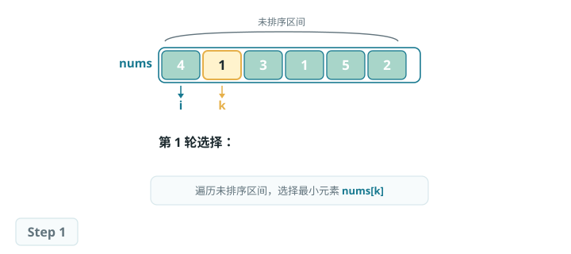

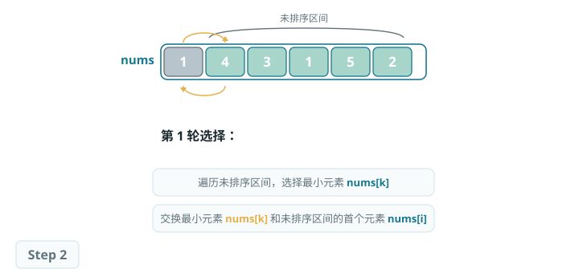

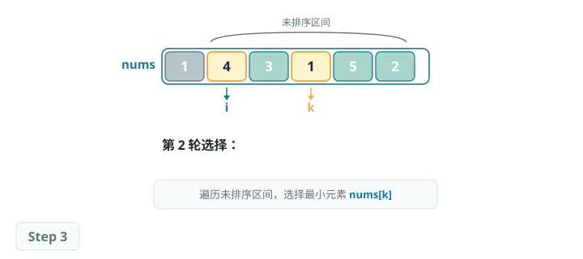

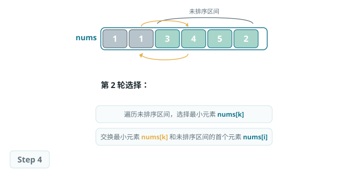

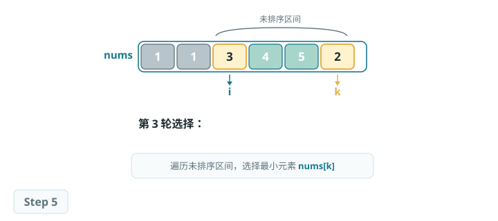

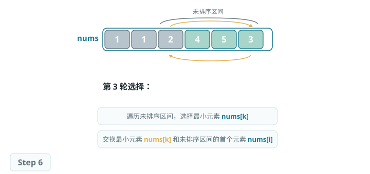

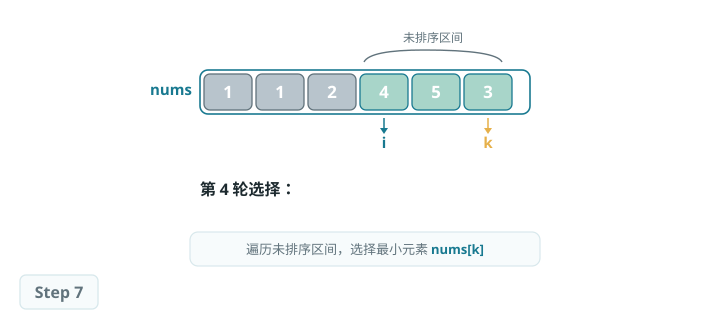

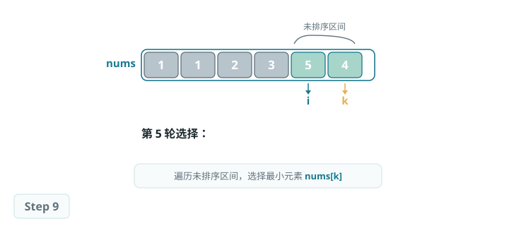

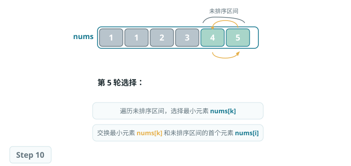

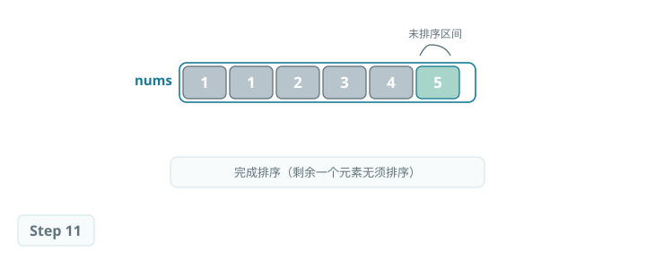

## 算法特性

- **时间复杂度为 O(n²)、非自适应排序：**外循环共 n-1 轮，第一轮的未排序区间长度为 n，最后一轮的未排序区间长度为 2，即各轮外循环分别包含 n、n-1、...、3、2 轮内循环，求和为 (n-1)(n+2)/2。
- **空间复杂度为 O(1)、原地排序：**指针 i 和 j 使用常数大小的额外空间。
- **非稳定排序：**如图所示，元素 nums[i] 有可能被交换至与其相等的元素的右边，导致两者的相对顺序发生改变。

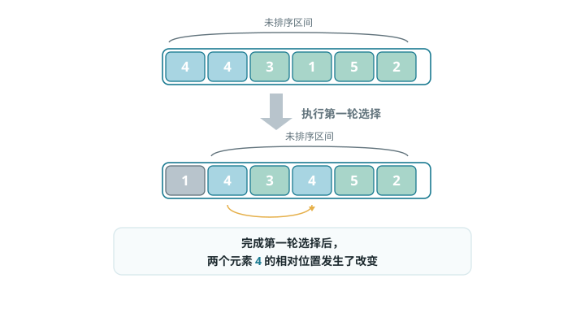

*选择排序的非稳定性示例*

## Baseline 任务 1：选择排序的基础实现

### 任务内容

完成 SelectSort.cpp，实现选择排序：

- 每次从未排序区间找到最小值，放到已排序区间末尾
- 基于比较的原地排序算法
- 时间复杂度：O(n²)
- 空间复杂度：O(1)
- 不稳定排序

### 验证方式

- 编译：`g++ testSelectSort.cpp SelectSort.cpp -o testSelectSort`
- 运行：`./testSelectSort`

## Baseline 任务 2：选择排序算法的优化

> 在实践中，我们会发现选择排序存在明显的短板：例如，在每一轮都只能找到一个最值，无法利用遍历过程中获取的信息；或者，在面对大量重复元素时，效率低下。
>
> 这些问题都指向了一个方向：选择排序还有很大的优化空间。

### 任务内容：双向选择排序（双端选择排序）

传统的简单选择排序，每一轮遍历只找到一个最小值，放到序列的前端。尝试实现双向选择排序：

- **核心思想：**在每一轮遍历中，同时找到当前未排序部分的最小值和最大值，并将它们分别放到序列的两端。
- **要求：**
    1. 实现 `void TwoWaySelectSort(vector<int>& arr)` 函数。
    2. 编写测试程序，验证该算法在不同场景下的正确性（如随机数组、有序数组、逆序数组）。
    3. 分析其与简单选择排序的时间复杂度对比（理论与实际运行时间），并解释其改进点。

### 文件结构

- `SelectionSort.h`：选择排序函数声明
- `SelectionSort.cpp`：选择排序核心算法实现
- `testSelectionSort.cpp`：测试程序，验证排序功能正确性
