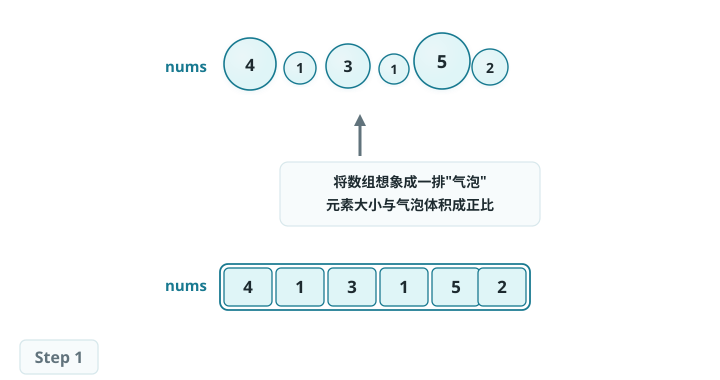
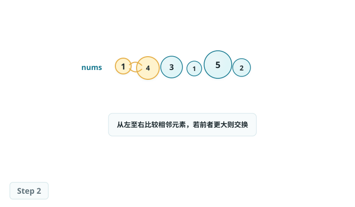
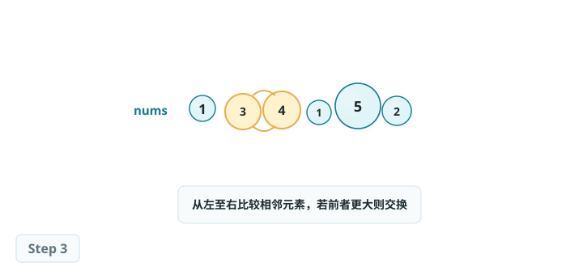
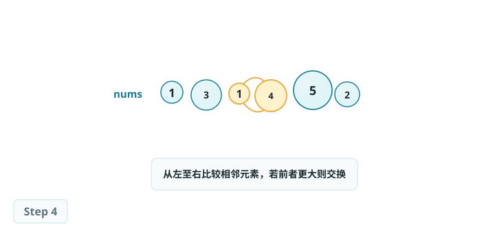
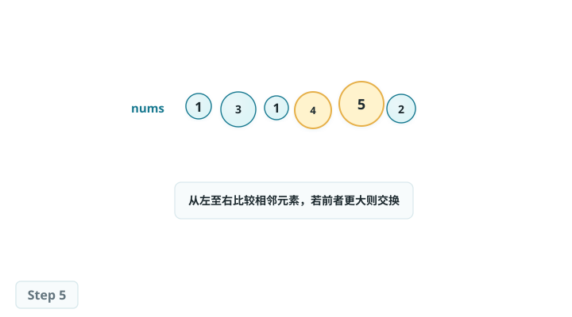
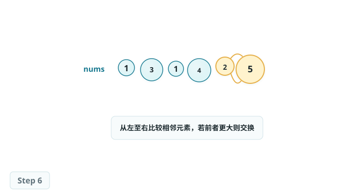
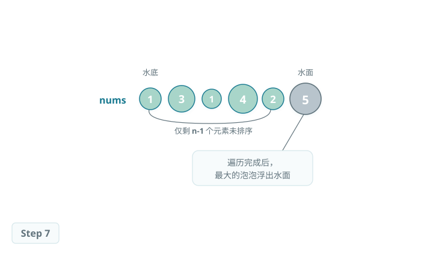
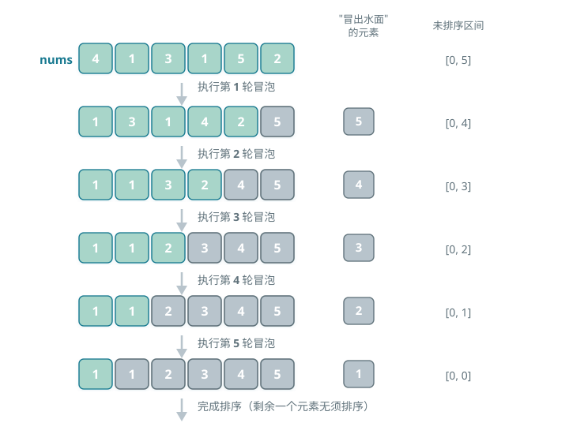

# 冒泡排序（Bubble Sort）

> 冒泡排序通过连续地比较与交换相邻元素实现排序。
>
> 这个过程就像气泡从底部升到顶部一样，因此得名冒泡排序。

### 冒泡过程模拟

如图所示，冒泡过程可以利用元素交换操作来模拟：从数组最左端开始向右遍历，依次比较相邻元素大小，如果"左元素 > 右元素"就交换二者。遍历完成后，最大的元素会被移动到数组的最右端。

## 算法流程

设数组的长度为 n，冒泡排序的步骤如图所示。

1. 首先，对 n 个元素执行"冒泡"，将数组的最大元素交换至正确位置。
2. 接下来，对剩余 n-1 个元素执行"冒泡"，将第二大元素交换至正确位置。
3. 以此类推，经过 n-1 轮"冒泡"后，前 n-1 大的元素都被交换至正确位置。
4. 仅剩的一个元素必定是最小元素，无须排序，因此数组排序完成。

*冒泡排序整体流程*

## 算法特性

- **时间复杂度为 O(n²)、自适应排序：**各轮"冒泡"遍历的数组长度依次为 n-1、n-2、...、2、1，总和为 (n-1)n/2。在引入 flag 优化后，最佳时间复杂度可达到 O(n)。
- **空间复杂度为 O(1)、原地排序：**指针 i 和 j 使用常数大小的额外空间。
- **稳定排序：**由于在"冒泡"中遇到相等元素不交换。

## Baseline 任务 1：冒泡排序的基础实现

### 任务内容

完成 BubbleSort.cpp，实现冒泡排序：

- 重复遍历数组，依次比较相邻元素并交换
- 每次循环将最大元素"冒泡"到末尾
- 原地排序、稳定排序
- 时间复杂度：O(n²)
- 空间复杂度：O(1)

### 验证方式

- 编译：`g++ testBubbleSort.cpp BubbleSort.cpp -o testBubbleSort`
- 运行：`./testBubbleSort`

## Baseline 任务 2：冒泡排序算法的优化

> 在实践中，我们会发现冒泡排序存在明显的短板：例如，在数组已经有序时仍会进行无用遍历；在部分有序的数组中会进行大量无效比较；或者在处理"小元素在末尾"的场景时，移动效率极低。
>
> 这些问题都指向了一个方向：冒泡排序还有很大的优化空间。

### 任务内容：带提前终止的冒泡排序

原始冒泡排序无论数组是否有序，都会执行完整的双层循环，造成大量冗余操作。尝试实现带有序检测的冒泡排序：

- **核心思想：**在每一轮遍历中记录是否发生交换，若某一轮未交换任何元素，说明数组已有序，直接提前终止排序。
- **要求：**
    1. 实现 `void BubbleSortEarlyExit(vector<int>& arr)` 函数。
    2. 编写测试程序，验证该算法在不同场景下的正确性（如随机数组、有序数组、逆序数组）。
    3. 分析其与简单冒泡排序的时间复杂度对比（理论与实际运行时间），并解释其改进点。

### 文件结构

- `BubbleSort.h`：冒泡排序函数声明
- `BubbleSort.cpp`：冒泡排序核心算法实现
- `testBubbleSort.cpp`：测试程序，验证排序功能正确性
