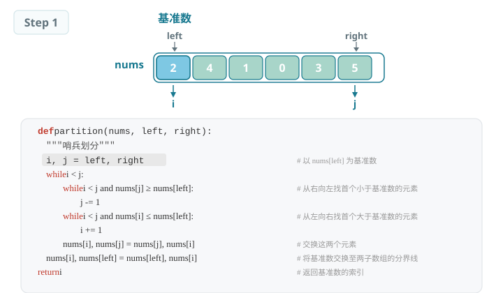
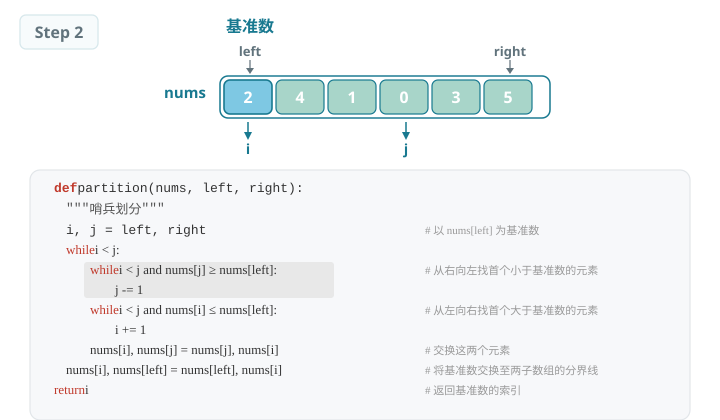
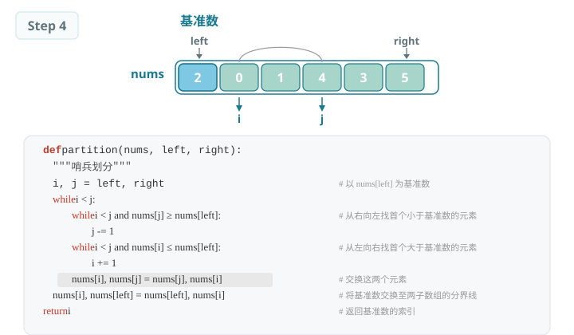
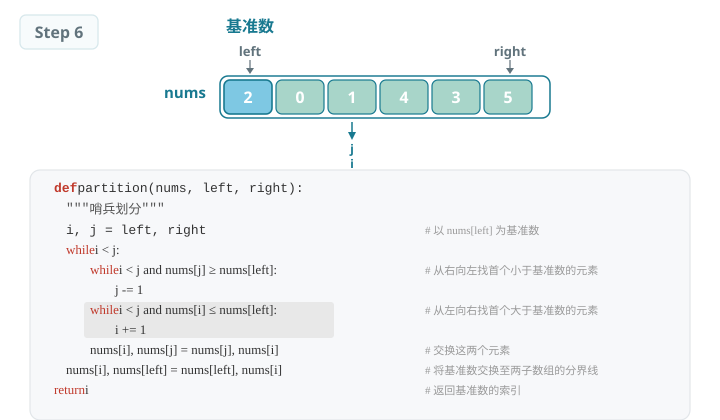
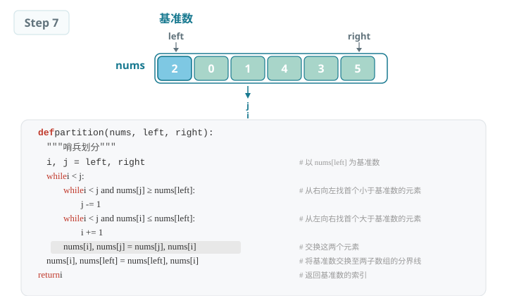
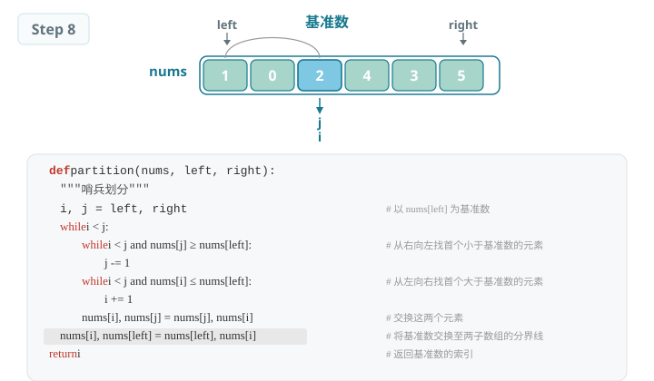
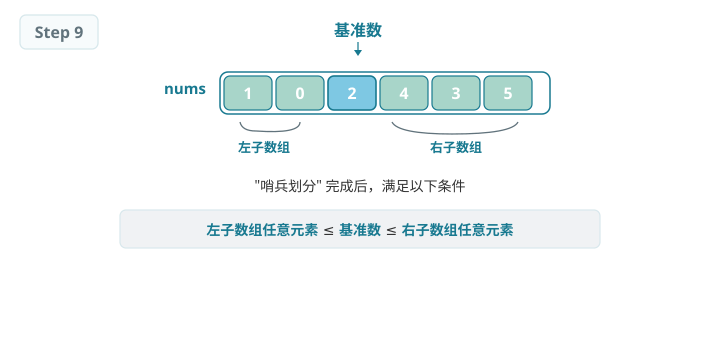
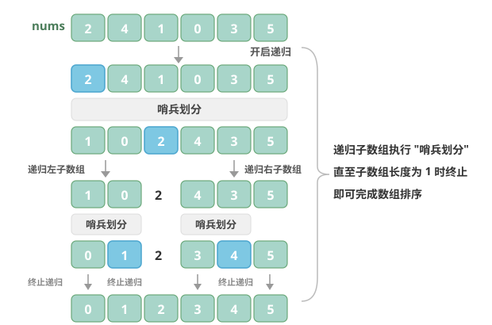

# 快速排序（Quick Sort）

> 快速排序是一种基于分治策略的排序算法，运行高效，应用广泛。

快速排序的核心操作是"哨兵划分"，其目标是：选择数组中的某个元素作为"基准数"，将所有小于基准数的元素移到其左侧，而大于基准数的元素移到其右侧。具体来说，哨兵划分的流程如图所示。

## 哨兵划分

1. 选取数组最左端元素作为基准数，初始化两个指针 i 和 j 分别指向数组的两端。
2. 设置一个循环，在每轮中使用 i（j）分别寻找第一个比基准数大（小）的元素，然后交换这两个元素。
3. 循环执行步骤 2，直到 i 和 j 相遇时停止，最后将基准数交换至两个子数组的分界线。

哨兵划分完成后，原数组被划分成三部分：左子数组、基准数、右子数组，且满足"左子数组任意元素 ≤ 基准数 ≤ 右子数组任意元素"。因此，我们接下来只需对这两个子数组进行排序。

快速排序的分治策略哨兵划分的实质是将一个较长数组的排序问题简化为两个较短数组的排序问题。

## 算法流程

快速排序的整体流程如图所示。

1. 首先，对原数组执行一次"哨兵划分"，得到未排序的左子数组和右子数组。
2. 然后，对左子数组和右子数组分别递归执行"哨兵划分"。
3. 持续递归，直至子数组长度为 1 时终止，从而完成整个数组的排序。

*快速排序整体流程*

## 算法特性

- **时间复杂度为 O(n log n)、非自适应排序：**在平均情况下，哨兵划分的递归层数为 log n，每层中的总循环数为 n，总体使用 O(n log n) 时间。在最差情况下，每轮哨兵划分操作都将长度为 n 的数组划分为长度为 0 和 n-1 的两个子数组，此时递归层数达到 n，每层中的循环数为 n，总体使用 O(n²) 时间。
- **空间复杂度为 O(n)、原地排序：**在输入数组完全倒序的情况下，达到最差递归深度 n，使用 O(n) 栈帧空间。排序操作是在原数组上进行的，未借助额外数组。
- **非稳定排序：**在哨兵划分的最后一步，基准数可能会被交换至相等元素的右侧。

## Baseline 任务 1：快速排序的基础实现

### 任务内容

完成 QuickSort.cpp，实现快速排序：

- 采用分治思想，以基准值将数组划分为两部分
- 递归对左右子数组进行排序
- 原地排序，平均效率极高
- 时间复杂度：平均 O(n log n)，最坏 O(n²)
- 空间复杂度：O(log n)
- 不稳定排序

### 验证方式

- 编译：`g++ testQuickSort.cpp QuickSort.cpp -o testQuickSort`
- 运行：`./testQuickSort`

## Baseline 任务 2：快速排序算法的优化

> 在实践中，我们会发现快速排序存在明显的短板：例如，在输入数组完全有序时，每次划分都会退化为"0和n-1"的极端情况，导致时间复杂度降至 O(n²)；或者在递归深度过大时，栈空间消耗过高；又或者面对重复元素较多的场景，效率下降明显。
>
> 这些问题都指向了一个方向：快速排序还有很大的优化空间。

### 任务内容：基准数优化（三数取中法）

传统快速排序如果固定选择数组左端元素作为基准数，在面对有序或逆序数组时会效率极低。尝试实现基于"三数取中"的基准数优化：

- **核心思想：**选取数组首、尾、中间位置的三个元素，以其中位数作为基准数，避免极端情况导致的划分失衡，大幅降低最坏情况出现的概率。
- **要求：**
    1. 实现 `int medianThree(vector<int>& nums, int left, int mid, int right)` 辅助函数，用于选取基准数。
    2. 实现 `int partition(vector<int>& nums, int left, int right)` 函数，集成三数取中优化。
    3. 编写测试程序，验证该算法在有序数组、逆序数组、随机数组下的性能变化，对比原始快速排序的时间复杂度差异。

### 文件结构

- `QuickSort.h`：快速排序函数声明
- `QuickSort.cpp`：快速排序核心算法实现
- `testQuickSort.cpp`：测试程序，验证排序功能正确性
